

  

  <h1 style="color: #bb0202; font-size: 26px; margin: 0;">Universidad Peruana de Ciencias Aplicadas</h1>
  

    Facultad de Ingeniería 
    Carrera: Ingeniería de Software
  

  

  

    
<strong>Ciclo:</strong> Quinto

    
<strong>Curso:</strong> 1ASI0730 Aplicaciones Web

    
<strong>NRC:</strong> 12158

    
<strong>Docente:</strong> Oscar Ivan Villafuerte Bazan

  

  <h2 style="font-size: 32px; text-transform: uppercase; margin: 40px 0;">"Informe del AV1"</h2>

  

    
<strong>Nombre del Startup:</strong> Performily

    
<strong>Nombre del Producto:</strong> Flowboard

  

   

  <h3 style="text-align: left; width: 85%; border-bottom: 1px solid #003366; padding-bottom: 5px; color: #003366;">Integrantes:</h3>
  
  <table style="width: 85%; border-collapse: collapse; margin-top: 15px; border: 1px solid #ddd;">
    <thead>
      <tr style="background-color: #f2f2f2; text-align: left;">
        <th style="padding: 12px; border-bottom: 2px solid #ddd;">Nombres y Apellidos</th>
      </tr>
    </thead>
    <tbody>
      <tr><td style="padding: 10px; border-bottom: 1px solid #eee;">Darío Fabián Ávila De La Cruz</td></tr>
      <tr><td style="padding: 10px; border-bottom: 1px solid #eee;">Diego Alonso Diaz Villalba</td></tr>
      <tr><td style="padding: 10px; border-bottom: 1px solid #eee;">Salym Pool Galvez Meza</td></tr>
      <tr><td style="padding: 10px; border-bottom: 1px solid #eee;">Oscar Lizandro Vasquez Llave</td></tr>
      <tr><td style="padding: 10px; border-bottom: 1px solid #eee;">Josué Francisco Carpio Peña</td></tr>
    </tbody>
  </table>

    

  <h3 style="color: #666;">Abril, 2026</h3>

## Contenido
# Tabla de contenidos

* **Registro de Versiones del Informe**
* **Project Report Collaboration Insights**
* **Student Outcome**

### Capítulo I: Introducción
* **1.1. Startup Profile**
  * 1.1.1. Descripción de la Startup
  * 1.1.2. Perfiles de integrantes del equipo
* **1.2. Solution Profile**
  * 1.2.1 Antecedentes y problemática
  * 1.2.2 Lean UX Process
    * 1.2.2.1. Lean UX Problem Statements
    * 1.2.2.2. Lean UX Assumptions
    * 1.2.2.3. Lean UX Hypothesis Statements
    * 1.2.2.4. Lean UX Canvas
* **1.3. Segmentos objetivos**

### Capítulo II: Requirements Elicitation & Analysis
* **2.1. Competidores**
  * 2.1.1. Análisis competitivo
  * 2.1.2. Estrategias y tácticas frente a competidores
* **2.2. Entrevistas**
  * 2.2.1. Diseño de entrevistas
  * 2.2.2. Registro de entrevistas
  * 2.2.3. Análisis de entrevistas
* **2.3 Needfinding**
  * 2.3.1. User Personas
  * 2.3.2. User Task Matrix
  * 2.3.3. User Journey Mapping
  * 2.3.4. Empathy Mapping
* **2.4. Big Picture EventStorming**
* **2.5. Ubiquitous Language**

### Capítulo III: Requirements Specification
* **3.1. User Stories**
* **3.2. Impact Mapping**
* **3.3. Product Backlog**

### Capítulo IV: Product Design
* **4.1. Style Guidelines**
  * 4.1.1. General Style Guidelines
  * 4.1.2. Web Style Guidelines
* **4.2. Information Architecture**
  * 4.2.1. Organization Systems
  * 4.2.2. Labeling Systems
  * 4.2.3. SEO Tags and Meta Tags
  * 4.2.4. Searching Systems
  * 4.2.5. Navigation Systems
* **4.3. Landing Page UI Design**
  * 4.3.1. Landing Page Wireframe
  * 4.3.2. Landing Page Mock-up
* **4.4. Web Applications UX/UI Design**
  * 4.4.1. Web Applications Wireframes
  * 4.4.2. Web Applications Wireflow Diagrams
  * 4.4.3. Web Applications Mock-ups
  * 4.4.4. Web Applications User Flow Diagrams
* **4.5. Web Applications Prototyping**
* **4.6. Domain-Driven Software Architecture**
  * 4.6.1. Design-Level EventStorming
  * 4.6.2. Software Architecture Context Diagram
  * 4.6.3. Software Architecture Container Diagrams
  * 4.6.4. Software Architecture Components Diagrams
* **4.7. Software Object-Oriented Design**
  * 4.7.1. Class Diagrams
* **4.8. Database Design**
  * 4.8.1. Database Diagrams

### Capítulo V: Product Implementation, Validation & Deployment
* **5.1. Software Configuration Management**
  * 5.1.1. Software Development Environment Configuration
  * 5.1.2. Source Code Management
  * 5.1.3. Source Code Style Guide & Conventions
  * 5.1.4. Software Deployment Configuration
* **5.2. Landing Page, Services & Applications Implementation**
  * 5.2.X. Sprint 1
    * 5.2.X.1. Sprint Planning 1
    * 5.2.X.2. Aspect Leaders and Collaborators
    * 5.2.X.3. Sprint Backlog n
    * 5.2.X.4. Development Evidence for Sprint Review
    * 5.2.X.5. Execution Evidence for Sprint Review
    * 5.2.X.6. Services Documentation Evidence for Sprint Review
    * 5.2.X.7. Software Deployment Evidence for Sprint Review
    * 5.2.X.8. Team Collaboration Insights during Sprint
* **5.4. Video About-the-Product**

### Conclusiones
* **Conclusiones y recomendaciones**
* **Video About-the-Team**

### Bibliografía
* **Bibliografía**
* **Anexos**

## Registro de Versiones del Informe

| Versión | Fecha | Autor | Descripción de modificación |
| :--- | :--- | :--- | :--- |
| v1.0 | 30/03/2026 | Darío Fabián Ávila De La Cruz | Descripción de la startup |
| v1.1 | 31/03/2026 | Oscar Lizandro Vasquez Llave | How (Cómo), How much (Cuánto), Lean UX Problem Statements, Lean UX Canvas |
| v1.1 | 31/03/2026 | Salym Pool Galvez Meza | What (Qué), Lean UX Assumptions. |
| v1.1 | 31/03/2026 | Diego Alonso Diaz Villalba | When (Cuándo), Where (Dónde), Segmentos objetivos |
| v1.1 | 31/03/2026 | Darío Fabián Ávila De La Cruz | Who (Quién), Why (Por qué), Lean UX Hypothesis Statements, Lean UX Canvas |
| v1.2 | 01/04/2026 | Diego Alonso Diaz Villalba | Diseño de entrevistas |
| v1.2 | 01/04/2026 | Oscar Lizandro Vasquez Llave | Análisis competitivo |
| v1.3 | 02/04/2026 | Oscar Lizandro Vasquez Llave | Estrategias y tácticas frente a competidores. |
| v1.4 | 06/04/2026 | Oscar Lizandro Vasquez Llave | Registro de entrevistas |
| v1.5 | 07/04/2026 | Darío Fabián Ávila De La Cruz | Registro de entrevistas, Análisis de entrevistas, Journey Mapping |
| v1.5 | 07/04/2026 | Oscar Lizandro Vasquez Llave | User Personas, User Task Matrix |
| v1.5 | 07/04/2026 | Diego Alonso Diaz Villalba | User Stories |
| v1.6 | 08/04/2026 | Josué Francisco Carpio Peña | Ubiquitous Language |
| v1.6 | 09/04/2026 | Diego Alonso Diaz Villalba | Event Storming |
| v1.7 | 10/04/2026 | Darío Fabián Ávila De La Cruz | User Stories |
| v1.7 | 13/04/2026 | Diego Alonso Diaz Villalba | Big Picture Eventstorming |
| v1.8 | 15/04/2026 | Darío Fabián Ávila De La Cruz | Impact Mapping |
| v1.8 | 15/04/2026 | Oscar Lizandro Vasquez Llave | General Style Guidelines |
| v1.9 | 18/04/2026 | Oscar Lizandro Vasquez Llave | Software Development Environment Configuration, Source Code Management, Source Code Style Guide & Conventions, Software Deployment Configuration |

## Capítulo I: Introducción

### 1.1. Startup Profile

#### 1.1.1. Descripción de la Startup

Somos Performily, una startup que está conformada por estudiantes de la Universidad Peruana de Ciencias Aplicadas (UPC). Esta iniciativa surge con el propósito de desarrollar soluciones tecnológicas orientadas en facilitar los procesos de los trabajadores empresariales. 

La razón de ser de nuestra startup radica en la necesidad de contar con herramientas que permitan a las personas gestionar de manera eficiente sus actividades y flujos de trabajo, lo cual favorece a la mejora del clima laboral e impulsa un entorno productivo dentro de la organización. Nuestra meta es brindar a los usuarios una herramienta que les permita tener control práctico y accesible de las gestiones de diferentes áreas empresariales mediante soluciones digitales intuitivas.

* **Misión:** Crear soluciones tecnológicas innovadoras que faciliten la gestión de personas en las organizaciones y promuevan la eficiencia laboral y la sostenibilidad.
* **Visión:** Para este 2026, consolidarnos como una startup referente en soluciones tecnológicas para la gestión de colaboradores y el impulso de la eficiencia en los procesos internos para contribuir a una sociedad con entornos laborales más profesionales y organizados.

### 1.1.2. Perfiles de integrantes del equipo

| Fotografía | Integrante | Código | Carrera | Perfil |
| :--- | :--- | :--- | :--- | :--- |
|  | Darío Ávila De La Cruz | u202412270 | Ingeniería de software | Mi nombre es Darío Ávila, soy estudiante universitario de la carrera de Ingeniería de Software, cursando el 5.º ciclo. Cuento con conocimientos en lenguajes de programación C++ y Python, lo que me permite desarrollar soluciones técnicas eficientes y adaptables. Practico la escucha activa para comprender a fondo las necesidades tanto del equipo como de los clientes, asegurando que los objetivos se alineen con las expectativas. Además, busco soluciones innovadoras que integren distintas perspectivas, fomentando la colaboración y la creatividad. Soy flexible ante cambios inesperados en los proyectos, adaptándome rápidamente a nuevas prioridades o requerimientos. |
|  | Diego Alonso Diaz Villalba | u202412663 | Ingeniería de software | Cuento con formación en Psicología y actualmente curso la carrera de Ingeniería de Software, lo que me permite integrar habilidades humanas con conocimientos técnicos. Tengo experiencia en la conducción de entrevistas, la identificación de necesidades mediante observación y escucha activa, así como en la toma de decisiones fundamentadas. Me interesa especialmente el diseño de software, con énfasis en el análisis de requerimientos, la experiencia de usuario (UX), la interfaz de usuario (UI) y la usabilidad de las aplicaciones. Me motiva crear soluciones tecnológicas que no solo sean funcionales, sino también intuitivas y accesibles para los usuarios. |
|  | Salym Pool Galvez Meza | u202419655 | Ingeniería de Software | Soy Salym Galvez, una persona con sólidas habilidades blandas como el pensamiento crítico y la escucha activa, lo que me permite analizar situaciones para encontrar soluciones efectivas y potenciar el trabajo en equipo. Me adapto con facilidad a distintos entornos, soy proactivo, responsable y orientado a resultados. En el aspecto técnico, cuento con conocimientos en C++ enfocados en la optimización de recursos, así como en el levantamiento de bases de datos y el desarrollo de sitios web utilizando JavaScript, HTML y CSS. Busco siempre aprender cosas nuevas para crecer profesionalmente y aportar valor práctico y técnico en cada proyecto en el que participo. |
|  | Oscar Lizandro Vasquez Llave | u202410478 | Ingeniería de Software | Soy estudiante de Ingeniería de Software con formación en desarrollo de aplicaciones y gestión de proyectos tecnológicos. Cuento con conocimientos en C++, HTML, CSS, JavaScript, diseño de interfaces de usuario con Figma y uso de herramientas de control de versiones como Git. Me destaco por mi compromiso para aprender nuevas tecnologías, además de mis habilidades para trabajar en equipo y adaptarme a diferentes entornos. Tengo capacidad para analizar y resolver problemas técnicos de forma eficiente. Poseo iniciativa para proponer mejoras, disposición para colaborar en proyectos multidisciplinarios y motivación por adquirir nuevos conocimientos que fortalezcan mi desarrollo profesional. |
|  | Josué Francisco Carpio Peña | *No especificado* | Ingeniería de Software | Soy estudiante de la carrera Ingeniería de Software con experiencia en Frontend con las herramientas HTML, CSS y Javascript; tengo conocimiento en programación con los lenguajes C++ y Python. Tengo las cualidades de ser perseverante e insistentes en las cosas que quiero hacer, gusto de aprender nuevas cosas y con un gran gusto de trabajo colaborativo. |

### 1.2. Solution Profile

#### 1.2.1 Antecedentes y problemática

**What (Qué):** La gestión del talento humano enfrenta una crisis de eficiencia caracterizada por una profunda carga burocrática y una dependencia crítica de procesos manuales. Esta problemática central se ve agravada por el uso de métodos empíricos y la preocupante ausencia de planificación estratégica en las organizaciones, lo que obliga a los gestores a operar basándose exclusivamente en la experiencia personal.

Esta estructura burocrática y el uso de herramientas obsoletas desencadenan síntomas directos que afectan la salud organizacional. El síntoma más visible es el incremento de la presión sobre el personal, ya que la alta presión y el estrés perjudican drásticamente la productividad de los empleados, lo que dificulta su desarrollo. Al carecer de recursos adecuados para realizar tareas repetitivas, surge una alta incidencia de malas prácticas en las condiciones laborales, un fenómeno alarmante que afecta al 50% de las organizaciones en América Latina, según destacan **Bautista et al. (2020)**.

La insatisfacción del trabajador aparece como una consecuencia inevitable de este sistema arcaico. **Ortiz et al. (2024)** advierten que cuando la alineación entre las metas estratégicas de la institución y las habilidades de los trabajadores es débil o inexistente, la evaluación del desempeño es percibida de manera negativa por el personal, reduciendo su productividad general. Esto erosiona el compromiso hacia la empresa y genera un clima organizacional donde la desmotivación puede conducir a resultados más negativos.

En este contexto, la revisión sistemática de **Tejada (2025)** confirma que depender de procesos tradicionales hace imposible alcanzar los planes y metas trazadas por las entidades. Por lo tanto, para recuperar la celeridad operativa y eliminar la burocracia, resulta imperativo automatizar los procedimientos ligados a la gestión de los recursos humanos a través de herramientas tecnológicas adecuadas.

**When (Cuándo):** La problemática se presenta de manera constante a lo largo de todo el ciclo de gestión del recurso humano en procesos como el registro y actualización de datos del personal, el control diario de asistencia y puntualidad, el procesamiento periódico de planillas y la gestión de beneficios laborales, sobre todo cuando el registro de estos datos es manual. Asimismo, se intensifica en situaciones que involucran la solicitud y aprobación de vacaciones, licencias o permisos, donde la dependencia de procesos manuales genera retrasos acumulativos. De igual forma, el problema se evidencia con mayor impacto en periodos de cierre de nómina o evaluaciones de desempeño, donde la carga operativa aumenta y los errores se vuelven más frecuentes.

**Where (Dónde):** La problemática ocurre dentro de las organizaciones que carecen de sistemas digitales integrados para la gestión de recursos humanos. Este escenario es particularmente evidente en empresas de América Latina, donde un 17% de las compañías en la región se encuentran operando con procesos tradicionales y desarticulados donde se emplean herramientas dispersas como hojas de cálculo, documentos físicos y sistemas aislados que no comparten información entre sí (**EY. Perú, 2025**). 

**Who (Quién):** Los afectados directos son, en primer lugar, los trabajadores quienes experimentan desconfianza y frustración al no contar con acceso directo a su información, el estado de sus solicitudes o la claridad sobre sus beneficios, lo que deteriora su experiencia y compromiso laboral. En segundo lugar está el área de RRHH, la cual enfrenta una sobrecarga administrativa crítica al tener que resolver consultas repetitivas y gestionar procesos ineficientes que consumen tiempo valioso. 

**Why (Por qué):** La problemática persiste porque las organizaciones carecen de una transformación digital efectiva que integre sus procesos en una plataforma centralizada, lo que obliga a depender de sistemas fragmentados y métodos manuales que vulneran la integridad de los datos. Esta situación se agrava por una marcada resistencia al cambio y la carencia de competencias digitales en el personal, lo que impide que la información laboral fluya con transparencia y agilidad. Por lo tanto, se generan cuellos de botella en las aprobaciones, errores frecuentes en la gestión de beneficios y una incapacidad estructural para realizar análisis estratégicos o predictivos sobre el capital humano. Además, la ausencia de flujos automatizados y de una "fuente única de verdad" limita la capacidad de RRHH para dejar de ser un área meramente operativa y convertirse en un socio estratégico para la toma de decisiones.

**How (Cómo):** El problema se manifiesta mediante una gestión operativa basada en métodos convencionales y registros físicos que entorpecen la agilidad organizacional. Los procesos de asistencia, solicitudes de licencias y el cálculo de planillas dependen de la verificación manual y el reingreso constante de datos en archivos aislados. Al respecto, **Feriandy (2025)** explica que el uso de estas herramientas obsoletas limita la capacidad de análisis y retrasa la atención de requerimientos internos. Asimismo, **Anggoro et al. (2026)** sostienen que esta dinámica operativa incrementa la opacidad en la información y deriva en decisiones de promoción fundamentadas en la intuición en lugar de métricas objetivas.

**How much (Cuánto):** El uso de métodos manuales en la gestión de recursos humanos impacta negativamente en la rentabilidad y el tiempo operativo de las empresas. **Feriandy (2025)** detalla que el procesamiento de asistencia y tareas administrativas requiere entre 3 y 5 días por ciclo bajo un esquema convencional. Bajo estas condiciones, la tasa de errores en el ingreso de datos alcanza niveles del 15% al 20% de las transacciones. En el área de compensaciones, los errores de cálculo salarial afectan del 10% al 15% de los pagos realizados. Desde la perspectiva del colaborador, el acceso a información personal demanda un promedio de 150 minutos por solicitud. La burocracia en los flujos de aprobación extiende la espera para licencias o vacaciones entre 48 y 72 horas. **Anggoro et al. (2026)** contrastan estos indicadores con los sistemas digitales, los cuales reducen los errores a menos del 2% y agilizan el acceso a la información a menos de 5 minutos.

### 1.2.2 Lean UX Process

#### 1.2.2.1. Lean UX Problem Statements

**Domain (Dominio):** El dominio de este proyecto se sitúa en la Gestión del Capital Humano (HCM) y la Transformación Digital de Recursos Humanos (HRIS) para organizaciones modernas. El enfoque principal aborda la transición necesaria de métodos manuales hacia sistemas de información integrados que aseguren la eficiencia operativa y el cumplimiento de las normativas laborales vigentes.

**Customer Segments (Segmentos de Clientes):** En primer lugar, los analistas de recursos humanos enfrentan una sobrecarga administrativa crítica al gestionar procesos ineficientes que consumen tiempo valioso, lo que los obliga a operar basándose en la experiencia personal ante la ausencia de planificación estratégica. Su principal dificultad radica en la verificación manual y el reingreso constante de datos en archivos aislados, lo que incrementa la incidencia de errores en la información del personal y dificulta la transparencia en la entrega de beneficios o bonificaciones pactadas. Esta problemática se intensifica debido a la carencia de un sistema centralizado, lo que fragmenta la información laboral en herramientas obsoletas y métodos convencionales que vulneran la integridad de los datos.

En segundo lugar, los empleados generales experimentan desconfianza y frustración al no contar con acceso directo a su propia información laboral, como saldos de vacaciones o el estado de sus solicitudes. Esta asimetría informativa los obliga a depender de consultas repetitivas hacia el área de RR.HH., generando una espera de entre 48 y 72 horas para aprobaciones básicas, lo que deteriora su experiencia y compromiso con la empresa.

**Pain Points (Puntos de Dolor):** La problemática actual genera costos específicos y estrés organizacional debido a una carga administrativa excesiva. Al respecto, **Feriandy (2025)** detalla que el procesamiento manual de asistencia y tareas operativas consume entre 3 y 5 días por ciclo. Esta ineficiencia se traduce en una tasa de errores en el ingreso de datos de entre el 15% y 20%, lo cual impacta incluso en el 10% al 15% de los cálculos salariales. Asimismo, la burocracia actual obliga al trabajador a invertir un promedio de 150 minutos solo para acceder a su información personal y esperar entre 48 y 72 horas para la aprobación de una licencia.

**Gap (La Brecha):** Existe una brecha tecnológica crítica entre la necesidad de agilidad de las empresas modernas y la persistencia de herramientas obsoletas como el papel o archivos de Excel aislados. Según explican **Anggoro et al. (2026)**, esta fragmentación de la información impide que las organizaciones optimicen sus funciones de recursos humanos mediante el uso efectivo de tecnología integrada. Mientras que la adopción global de sistemas HRIS alcanza el 73%, en mercados regionales esta cifra desciende al 45%. **Feriandy (2025)** sostiene que esta disparidad genera una incapacidad estructural para realizar análisis estratégicos o predictivos sobre el capital humano, lo cual limita la competitividad en la era digital.

**Vision/Strategy (Visión y Estrategia):** La estrategia de Performily consiste en implementar una plataforma centralizada que funcione para eliminar la fragmentación de datos. La visión del producto es automatizar los procedimientos ligados a la gestión humana para recuperar la celeridad operativa, con el objetivo de reducir el margen de error a menos del 2% en las transacciones de datos y agilizar la atención de solicitudes de información a menos de 5 minutos.

**Initial Segment (Segmento Inicial):** El enfoque inicial se dirigirá a organizaciones que enfrentan una crisis de eficiencia caracterizada por una profunda carga burocrática y una dependencia crítica de procesos manuales. Para ello, evaluaremos indicadores en las organizaciones como la tasa de error en transacciones, el tiempo de procesamiento por ciclo de asistencia y el tiempo de respuesta a solicitudes de información personal. El perfil ideal son entidades donde el crecimiento del personal ha vuelto imposible alcanzar las metas trazadas mediante métodos tradicionales, requiriendo una transformación hacia la toma de decisiones basada en datos. Esto significa que el segmento inicial se concentra en empresas cuyo aumento en la cantidad de colaboradores ha superado la capacidad de sus sistemas de control actuales (como hojas de cálculo o registros físicos).

#### 1.2.2.2. Lean UX Assumptions

**¿Quiénes creemos que son nuestros usuarios principales?**
Asumimos que nuestros usuarios principales se dividen en dos perfiles que se encuentran relacionados en el entorno organizacional. Por un lado, empleados generales quienes necesitan acceder de forma transparente a su información general, beneficios y estado de solicitudes sin depender de trámites burocráticos. Por otro lado, el personal de recursos humanos, quienes gestionan la operatividad de la empresa, estos se encargan del control de asistencia, cálculo de planillas y aprobaciones y requieren urgentemente una plataforma centralizada para eliminar la sobrecarga administrativa y reducir el margen de error en sus procesos cotidianos.

**¿Qué problemas creemos que tienen los usuarios?**
Asumimos que los empleados generales al no tener acceso directo a su información, recurren a realizar múltiples consultas manuales hacía sus supervisores o al equipo de RRHH para conocer el estado de sus solicitudes. Tienen una necesidad fuerte por una plataforma de autogestión que les brinde transparencia, autonomía y respuestas inmediatas sin depender de la burocracia. También, observamos que el personal de recursos humanos dedica la mayor parte del tiempo a la ejecución de tareas mecánicas, realizando de igual modo múltiples revisiones cruzadas en archivos aislados para intentar mitigar la alta tasa de errores en las planillas. Necesitan de una herramienta centralizada con flujos de aprobación automatizados que elimine la reinserción de datos y les permita evolucionar de un rol netamente operativo a uno más estratégico. 

**¿Qué comportamientos o necesidades observamos?**
Asumimos que la carencia de un sistema integrado provoca comportamientos reactivos y necesidades urgentes, los cuales se manifiestan de forma distinta en nuestros dos segmentos objetivo. Por un lado, en el segmento de los colaboradores generales, observamos que, al carecer de acceso directo y transparente a su información laboral, el comportamiento habitual consiste en recurrir a canales informales o manuales para consultar el estado de sus licencias, vacaciones o beneficios. Por otro lado, en el segmento del personal de Recursos Humanos, el comportamiento cotidiano se basa en realizar múltiples verificaciones y reingresos manuales de datos en archivos aislados con el fin de procesar las asistencias y las planillas.

**¿Por qué creemos que esto es valioso para el usuario y para el negocio?**
Asumimos que la implementación de Flowboard generará un alto valor estratégico, impactando de manera positiva y bidireccional tanto en el bienestar del capital humano como en la rentabilidad de la organización. A nivel de los usuarios, esta solución resulta sumamente valiosa para los colaboradores generales porque les devuelve la autonomía sobre su información y reduce drásticamente los tiempos de espera, mitigando la frustración y mejorando su experiencia laboral; paralelamente, es invaluable para el equipo de Recursos Humanos al eliminar la carga mental y el estrés derivados de tareas manuales, permitiéndoles evolucionar hacia un rol enfocado en la retención del talento. A nivel de negocio, consideramos que la plataforma es altamente rentable porque ataca directamente las ineficiencias operativas que generan sobrecostos. Mediante la automatización, la empresa logrará reducir los ciclos de procesamiento administrativo de 3 a 5 días a tan solo unas horas, y disminuirá la tasa de errores salariales del 15% al 20% a menos del 2%, fomentando así un entorno transparente que garantice una mayor competitividad y sostenibilidad a largo plazo.

#### 1.2.2.3. Lean UX Hypothesis Statements

* **Creemos que** la implementación de una plataforma centrada para los personales de recursos humanos **resultará en** una reducción drástica del reingreso manual de datos en documentos independientes. **Sabremos que hemos tenido éxito cuando** observemos una reducción del 80% en el tiempo dedicado al procesamiento de planillas y gestión de asistencia por ciclo.

* **Creemos que** proporcionar un módulo de consulta directa para los empleados generales **resultará en** una mayor confianza y transparencia sobre su información laboral. **Sabremos que hemos tenido éxito cuando** obtengamos un puntaje de satisfacción superior al 70% en las encuestas acerca de transparencia de sus beneficios.

* **Creemos que** la automatización de los flujos de aprobación y el cálculo de beneficios para las organizaciones con crecimiento descomunal **resultará en** una reducción de los costos derivados de errores administrativos. **Sabremos que hemos tenido éxito cuando** la tasa de error en el ingreso de datos y cálculos salariales baje del 20% a menos del 2%.

* **Creemos que** sustituir las herramientas obsoletas por un panel de control en tiempo real para la toma de las decisiones **resultará en** una mayor agilidad y precisión para gestionar al personal. **Sabremos que hemos tenido éxito cuando** el tiempo de aprobación de solicitudes de licencias y permisos se reduzca de 72 horas a menos de 24 horas.

* **Creemos que** enfocar nuestro producto inicial en empresas que migran de sistemas tradicionales a digitales **resultará en** una adopción más rápida de la herramienta Flowboard. **Sabremos que hemos tenido éxito cuando** logremos que el 65% de los datos históricos de estas empresas se integren con éxito en la plataforma y se elimine por completo la dependencia de archivos físicos en los primeros 3 meses de uso.

#### 1.2.2.4. Lean UX Canvas

| Componente | Descripción |
| :--- | :--- |
| **1. Business Problem** | Las organizaciones actuales atraviesan una crisis de eficiencia en la gestión del talento humano debido a una profunda carga burocrática y procesos manuales. Esto genera errores administrativos, los empleados perciben escasa transparencia en su información y una incapacidad de RR.HH. para una acción estratégica. La dependencia de archivos aislados y métodos empíricos bloquean el cumplimiento de metas organizacionales y deteriora el clima laboral. |
| **2. Business Outcomes** | • Reducción del tiempo de procesamiento de planillas y asistencia en un 80%. • Disminución de la tasa de error en cálculos salariales y datos de un 20% a menos del 2%. • Reducción del tiempo de aprobación de solicitudes de 72 horas a menos de 24 horas. • Migración exitosa del 65% de datos históricos de archivos físicos a digitales en los primeros 3 meses. |
| **3. Users** | **Analistas de Recursos Humanos:** Profesionales que gestionan la operatividad, planillas y control de personal en empresas con crecimiento acelerado. **Empleados Generales:** Colaboradores que necesitan gestionar su propia información, beneficios y solicitudes de forma autónoma. |
| **4. User Outcomes & Benefits** | **Para RR.HH.:** Eliminación de tareas mecánicas, reducción de la carga mental y evolución hacia un rol estratégico de retención de talento. **Para Empleados:** Autonomía, reducción de la frustración por espera y mayor confianza en la empresa. |
| **5. Solutions** | **Plataforma Web:** Sistema centralizado para la gestión integral del capital humano. **Módulo de Autogestión:** Portal donde el empleado visualiza sus vacaciones, boletas y beneficios de forma directa. **Control de Asistencia Automatizado:** Registro digital que se integra directamente con el cálculo de la planilla. **Workflow de Solicitudes:** Sistema de estados (Pendiente / Aprobado / Rechazado) para vacaciones y permisos con notificaciones. **Dashboard:** Panel de control con indicadores de desempeño y productividad en tiempo real. |
| **6. Hypotheses** | • Creemos que la implementación de una plataforma centrada para RR.HH. resultará en una reducción drástica del reingreso manual de datos. Sabremos que hemos tenido éxito cuando observemos una reducción del 80% en el tiempo dedicado al procesamiento por ciclo. • Creemos que proporcionar un módulo de consulta para empleados resultará en mayor confianza. Sabremos que hemos tenido éxito cuando obtengamos un puntaje de satisfacción superior al 70%. • Creemos que la automatización de flujos y cálculo de beneficios resultará en la reducción de costos por errores. Sabremos que hemos tenido éxito cuando la tasa de error baje a menos del 2%. • Creemos que sustituir herramientas obsoletas por un panel de control en tiempo real resultará en mayor agilidad. Sabremos que hemos tenido éxito cuando el tiempo de aprobación se reduzca a menos de 24 horas. • Creemos que enfocar el producto inicial en empresas que migran a lo digital resultará en una adopción más rápida. Sabremos que hemos tenido éxito cuando logremos integrar el 65% de datos históricos en los primeros 3 meses. |
| **7. What’s the most important thing we need to learn first?** | • ¿Están los analistas de RR.HH. dispuestos a abandonar sus hojas de Excel actuales por un sistema digital? • ¿Qué tan difícil es para las empresas actuales migrar sus datos históricos fragmentados a nuestra plataforma? • ¿El empleado general valora la autogestión lo suficiente como para usar la app regularmente? |
| **8. What’s the least amount of work we need to do to learn the next most important thing?** | • Desarrollar un prototipo de alta fidelidad del Panel de RR.HH. y el Módulo del Empleado para pruebas de usabilidad. • Realizar una prueba de concepto con una "empresa en crecimiento" del segmento inicial, migrando solo el módulo de asistencia y vacaciones para medir la reducción de tiempos. • Realizar encuestas de entrada y salida para medir el nivel de confianza/transparencia percibido antes y después de ver la solución. |

### 1.3. Segmentos objetivos

#### Segmento 1: Personal de Recursos Humanos (RRHH)
Este segmento incluye a los profesionales responsables de la gestión operativa del talento humano dentro de la organización, encargados de procesos como el control de asistencia, cálculo de planillas, administración de beneficios y gestión de solicitudes. El principal problema para este grupo radica en la alta carga administrativa derivada del uso de herramientas fragmentadas y procesos manuales, lo que incrementa significativamente el riesgo de errores y retrasa la ejecución de tareas. El trabajo cotidiano del personal de RRHH se basa en la revisión constante y el reingreso de datos en múltiples archivos aislados, lo que limita su capacidad de análisis y toma de decisiones estratégicas.

#### Segmento 2: Colaboradores generales (empleados)
Este segmento está conformado por los trabajadores de la organización que requieren acceder a su información laboral de manera constante, incluyendo datos personales, beneficios, estado de solicitudes y registros de asistencia. El principal problema para los colaboradores generales consiste en la inaccesibilidad de acceso directo a esta información, lo que los obliga a depender de procesos burocráticos y consultas manuales con supervisores o el área de recursos humanos. Esta situación genera una experiencia ineficiente, caracterizada por tiempos de espera prolongados y desconfianza hacia la organización. Como consecuencia, los empleados desarrollan comportamientos reactivos, lo que recurre a canales informales para obtener información sobre vacaciones, licencias o pagos.

## Capítulo II: Requirements Elicitation & Analysis

### 2.1. Competidores

#### 2.1.1. Análisis competitivo

**Competitive Analysis Landscape**

* **¿Por qué llevar a cabo este análisis?**
  Se está llevando a cabo este Competitive Analysis Landscape para entender el mercado al que nos enfrentaremos como también para definir una estrategia para diferenciarnos de la competencia.

| Criterio | Flowboard (Nuestra Solución) | Buk | Factorial | Rex+ |
| :--- | :--- | :--- | :--- | :--- |
| **Perfil (Overview)** | Solución tecnológica centralizada diseñada para automatizar la gestión del talento en organizaciones que requieren migrar de procesos manuales a digitales. Integra asistencia, cálculo de planillas y beneficios, permitiendo la autogestión del empleado y optimizando la toma de decisiones de RR.HH. | Software de gestión de personas diseñado para centralizar todas las necesidades de los colaboradores en una sola plataforma. Automatiza desde el cálculo y pago de planillas hasta el desarrollo profesional, encuestas de clima y selección de personal para crear lugares de trabajo más felices. | Plataforma orientada a la automatización de procesos de recursos humanos para PYMES. Su enfoque principal es la eliminación de hojas de cálculo mediante control de asistencia, gestión de ausencias, firma electrónica y un portal de autogestión para comunicación directa. | Sistema de gestión especializado en la automatización de remuneraciones y cumplimiento de normativas laborales locales. Ofrece una solución robusta para procesamiento masivo de planillas, gestión de contratos y administración de expedientes digitales. |
| **Ventaja competitiva** | • Modelo de migración acelerada para registros físicos/virtuales.   • Elimina la dependencia de archivos aislados integrando asistencia y beneficios.   • Módulo de autogestión para resolución autónoma de dudas. | • Abarca todo el ciclo de vida del colaborador (encuestas, evaluaciones).   • Centraliza múltiples países en una sola plataforma (ideal multinacionales). | • Interfaz diseñada para fácil adopción en PYMES.   • Sistema de firma electrónica legalmente vinculante.   • Administración de ausencias y turnos en tiempo real. | • Motor de cálculo especializado en normativas laborales/tributarias locales.   • Infraestructura para procesamiento masivo de nómina.   • Alto nivel de seguridad en expedientes históricos. |
| **Mercado objetivo** | Organizaciones en expansión y analistas de RR.HH. saturados por métodos manuales que buscan una plataforma centralizada para facilitar la autogestión. | Grandes corporaciones y empresas multinacionales con presencia en Latinoamérica que buscan gestión humana de alto nivel. | Pequeñas y medianas empresas (PYMES) modernas que desean la digitalización de sus departamentos de recursos humanos. | Empresas consolidadas con nóminas complejas y alto volumen de transacciones que requieren un motor de cálculo robusto. |
| **Estrategias de marketing** | Difusión vía landing page con posicionamiento SEO, redes sociales con demostraciones interactivas y marketing educativo. | Difusión corporativa mediante eventos de liderazgo (HR Summits), creación de contenido especializado y posicionamiento como software líder regional. | Campañas enfocadas en productividad, presencia en LinkedIn y generación de guías descargables sobre digitalización y firma electrónica. | Alianzas con consultoras contables, participación en seminarios técnicos sobre normativas legales y campañas dirigidas a tomadores de decisiones. |
| **Productos & Servicios** | Sistema web para automatización de planillas, registro digital de asistencia, panel de control estratégico y módulo de autogestión del empleado. | Plataforma (web y app) para gestión de nóminas multinacional, evaluaciones, encuestas de clima, reclutamiento y selección. | Software (web y app) para control de asistencia, firma electrónica, gestión de turnos y portal de beneficios flexible. | Sistema (web y app) con motor de cálculo de remuneraciones masivo, expedientes digitales legales y administración de contratos bajo normativas. |
| **Precios & Costos** | Suscripción mensual basada en el número de empleados y esquema escalable según funcionalidades (incluye automatización, reportes y autogestión). | Suscripción mensual por colaborador activo, con planes escalables (Essential, Professional, Enterprise) según módulos y nivel de soporte. | Estructura de precios por usuario/mes (Business y Enterprise). Ofrece prueba gratuita limitada y planes ajustados a funcionalidades específicas. | Suscripción mensual calculada por el volumen de liquidaciones procesadas. Incluye inversión inicial de implementación técnica. |
| **Canales de distribución** | Landing page oficial, posicionamiento en buscadores (SEO) y redes sociales. | Sitio web institucional, equipo de ventas (Inside Sales), redes profesionales y eventos corporativos. | Landing page con prueba gratuita, tiendas de aplicaciones (Google Play/App Store), marketing de afiliación y gestorías. | Plataforma web, red de partners tecnológicos, consultoría de preventa y canales de soporte técnico especializado. |
| **Fortalezas (SWOT)** | • Especializado en migración rápida de datos históricos.   • Módulo de autogestión reduce consultas a menos de 5 min.   • No requiere hardware. | • Diseño centrado en el colaborador y cubre todo su ciclo de vida.   • Presencia y soporte local consolidado en múltiples países. | • Interfaz moderna y de fácil adopción.   • Firma electrónica integrada.   • Precios modulares para PYMES. | • Motor de cálculo extremadamente preciso y potente.   • Actualización constante según normativa vigente.   • Herramientas avanzadas de auditoría. |
| **Debilidades (SWOT)** | • Startup en desarrollo sin una base de usuarios masiva aún.   • Recursos limitados frente a los gigantes del sector. | • Costos de implementación elevados para PYMES.   • Curva de aprendizaje moderada por la cantidad de módulos. | • Limitaciones en integraciones profundas con ERPs contables antiguos.   • Motor de nómina nativo menos robusto en algunos países (requiere integraciones). | • Interfaz abrumadora para usuarios que buscan algo simple.   • Implementación compleja que requiere consultoría. |
| **Oportunidades (SWOT)** | • Creciente transición de modelos tradicionales a digitales.   • Mayor adopción de Business Intelligence.   • Alianzas estratégicas con consultoras de transformación digital. | • Creciente demanda de upskilling online.   • Tendencia al alza en beneficios flexibles y bienestar financiero. | • Digitalización de PYMES para reemplazar procesos en papel.   • Uso de IA en procesos de selección (ATS). | • Empresas con software obsoleto buscando migrar a la nube.   • Alianzas estratégicas con firmas de auditoría y contabilidad. |
| **Amenazas (SWOT)** | • Ingreso de competidores con mayor capital y funciones similares.   • Resistencia al cambio organizacional en empresas convencionales. | • Competencia de software globales con mayores presupuestos (I+D).   • Saturación del mercado corporativo en la región. | • Startups locales que ofrecen cumplimiento legal específico a menor costo.   • Cambios constantes en normativas laborales. | • Nuevos competidores con interfaces más modernas que simplifiquen el cumplimiento legal. |

#### 2.1.2. Estrategias y tácticas frente a competidores

| Matriz SWOT | Estrategia | Táctica |
| :--- | :--- | :--- |
| **Fortalezas y Oportunidades (FO)** | Aprovechar la capacidad de migración rápida de datos, la facilidad de uso y el enfoque integral del sistema para posicionarse como una solución clave en la digitalización de PYMES y empresas en crecimiento. | Promocionar la plataforma mediante casos reales donde se muestre la migración desde Excel o sistemas obsoletos hacia un sistema digital completo, destacando rapidez de implementación, facilidad de uso y beneficios en productividad. |
| **Debilidades y Oportunidades (DO)** | Reducir la percepción de complejidad y posicionar la marca mediante educación al cliente y generación de confianza en un mercado en crecimiento digital. | Desarrollar contenido educativo (tutoriales, webinars, demos guiadas) sobre digitalización de RR.HH., uso de BI y automatización, acompañado de campañas en redes que expliquen paso a paso cómo implementar el sistema sin dificultad. |
| **Fortalezas y Amenazas (FA)** | Establecer una diferenciación competitiva basada en la arquitectura web de la plataforma, la cual elimina la necesidad de instalaciones complejas o hardware adicional. | Difundir demostraciones funcionales del módulo de autogestión en canales digitales. Subrayar el acceso remoto a la información laboral sin requerir la descarga de aplicaciones nativas por parte del personal. |
| **Debilidades y Amenazas (DA)** | Minimizar el impacto de recursos limitados y complejidad del sistema frente a competidores consolidados, mejorando la experiencia inicial del usuario y el soporte. | Implementar un proceso de onboarding simplificado, asistencia personalizada durante la implementación y mejoras en el soporte técnico para poder priorizar tiempos de respuesta y resolución de problemas complejos. |

### 2.2. Entrevistas

#### 2.2.1. Diseño de entrevistas

**Preguntas de introducción**
* ¿Cómo te llamas?
* ¿Cuántos años tienes?
* ¿En qué distrito vives?
* ¿Estado civil?
* ¿Cuál es tu ocupación actual?

**Preguntas sobre su ocupación actual**
* ¿Cuántos años vienes desempeñando tú función actual?
* ¿Cuáles son las funciones de tu puesto?
* ¿Cómo es el flujo de trabajo en tu área, qué papel cumples dentro de ese flujo?
* ¿Cómo describirías tu día a día en el trabajo? (Productivo-Cansado-Estresado-Agotador)

**Segmento 1: Personal de Recursos Humanos**
* ¿Cuáles son tus principales responsabilidades dentro del área de RRHH?
* ¿Qué es lo más importante que buscas lograr en tu trabajo día a día?
* ¿Qué indicadores utilizas para evaluar el desempeño de los trabajadores?
* ¿Qué tan importante es para ti contar con información actualizada de los empleados? (Muy importante, importante, neutro, no tan importante, nada importante)
* ¿Qué procesos consideras críticos dentro de tu área (planilla, asistencia, licencias, etc.)?
* ¿Cómo gestionan actualmente la información de los empleados? (Excel, sistemas, documentos físicos, otros)
* ¿Cómo es el proceso para calcular la planilla?
* ¿Cómo gestionan las solicitudes de vacaciones, licencias o permisos?
* ¿Existe un flujo definido de aprobación o depende de cada caso?
* ¿Cómo realizan el control de asistencia y puntualidad?
* ¿Qué es lo que más te toma tiempo en tu trabajo diario?
* ¿Qué tareas sientes que son repetitivas o innecesarias?
* ¿Con qué frecuencia ocurren errores en planillas o registros?
* ¿Qué tipo de errores son los más comunes?
* ¿Qué es lo que más te frustra del proceso actual de gestión de RRHH?
* ¿Sientes que tienes sobrecarga de trabajo? ¿Por qué?
* ¿Con qué frecuencia los empleados te consultan sobre su información?
* ¿Qué tipo de consultas son las más repetitivas?
* ¿Te resulta fácil encontrar la información que necesitas de un empleado?
* ¿Has tenido problemas por información incompleta o desactualizada?
* ¿Qué herramienta o sistema te gustaría tener para facilitar tu trabajo?
* Si pudieras automatizar un proceso, ¿cuál sería y por qué?
* ¿Qué tan importante sería para ti tener una plataforma centralizada?
* ¿Cómo crees que mejoraría tu trabajo si los empleados pudieran autogestionar su información?
* Si pudieras cambiar una sola cosa del sistema actual de RRHH, ¿qué cambiarías?

**Segmento 2: Colaboradores generales**
* ¿Quién se encarga de evaluar tu desempeño laboral?
* ¿Sabes qué indicadores evalúan para determinar tu desempeño laboral?
* ¿Qué indicadores consideras que son importantes a la hora de evaluar tu desempeño?
* ¿Qué es lo más importante que buscas lograr en tu trabajo?
* ¿Qué te hace sentir que estás haciendo bien tu trabajo?
* Cuando hay una observación o reconocimiento sobre tu trabajo, ¿Quién se comunica contigo?
* ¿Qué medios utilizan para comunicarse contigo? (correo, WhatsApp, reuniones, otros)
* ¿Te gustaría recibir ese tipo de información de otra forma? ¿Cómo?
* ¿Tienes acceso directo a tu información laboral (beneficios, pagos, vacaciones, otros)?
* ¿Te encuentras en alguna plataforma web que contenga toda tu información como empleado?
* ¿Qué tan fácil es para ti acceder a esa información? 
* ¿Qué tipo de información consultas con más frecuencia? 
* Cuando necesitas información (vacaciones, pagos, estado de solicitudes), ¿qué haces normalmente? ¿A quién recurres primero?
* ¿Cuánto tiempo suele tomarte obtener esa información? 
* ¿Con qué frecuencia realizas este tipo de consultas?
* ¿Has tenido problemas con recursos humanos respecto a tu información o estado laboral?
* ¿Conoces casos donde se hayan olvidado de entregar algún beneficio?
* ¿Tus pagos siempre han sido puntuales o han presentado dificultades?
* ¿Te han dado vacaciones o sabes cuántos días te corresponden?
* ¿Qué es lo que más te incomoda del proceso actual para obtener información? 
* ¿Alguna vez te has sentido frustrado con RRHH? ¿Por qué? 
* ¿Qué te gustaría mejorar del sistema actual de gestión de empleados?
* ¿Te gustaría poder gestionar tú mismo tus solicitudes (vacaciones, permisos, otros)?
* ¿Qué tan importante sería para ti tener acceso inmediato a tu información? (escala muy importante, importante ….)
* ¿Qué funcionalidades te gustaría que tenga una plataforma ideal para empleados?
* Si pudieras cambiar una sola cosa en la forma en que gestionan tu información laboral, ¿qué cambiarías?

### 2.2.2. Registro de entrevistas.

#### Segmento 1: Personal de Recursos Humanos

**Entrevista 1:**
* **Nombre:** Juan Fernando Caicho Olorte
* **Edad:** 53 años
* **Distrito:** Barranca
* **Link de la entrevista:** https://upcedupe-my.sharepoint.com/:v:/g/personal/u202410478_upc_edu_pe/IQCoaZES8xugQ6v9JM3-75MDAXZJC0dgiZrI0kE1nvJcwVM?nav=eyJyZWZlcnJhbEluZm8iOnsicmVmZXJyYWxBcHAiOiJPbmVEcml2ZUZvckJ1c2luZXNzIiwicmVmZXJyYWxBcHBQbGF0Zm9ybSI6IldlYiIsInJlZmVycmFsTW9kZSI6InZpZXciLCJyZWZlcnJhbFZpZXciOiJNeUZpbGVzTGlua0NvcHkifX0&e=vPsroB
* **Timing donde inicia la entrevista:** 0:01
* **Duración completa de la entrevista:** 47:24

**Resumen de la entrevista:**
Juan Fernando Caicho Olorte, abogado de 53 años, casado y residente en Barranca, se desempeña desde hace cuatro años como jefe de recursos humanos en una entidad estatal prestadora de servicios de saneamiento bajo la administración de OTAS. En su cargo, dirige procesos de selección, contratación, evaluación de desempeño y administración de beneficios sociales, además de supervisar el clima laboral y aplicar medidas disciplinarias según el reglamento interno. El flujo de trabajo en su área involucra a un analista, un supervisor de seguridad y salud, y un especialista laboral, aunque enfrenta limitaciones económicas institucionales que impiden cubrir planillas con apoyo externo, destinando los recursos técnicos solo a proyectos de inversión. El proceso de elaboración de la planilla es manual y se apoya en el software Avalon, el cual presenta deficiencias al no calcular automáticamente impuestos como la renta de quinta categoría. El control de asistencia se realiza mediante relojes digitales cada día 21, tras lo cual se cruza la información con papeletas de permiso y horas extras para determinar los pagos y descuentos por tardanzas superiores a los 40 minutos mensuales. Respecto a las vacaciones, el personal obrero toma 30 días continuos, mientras que el administrativo puede fraccionarlas incluso por medios días. Actualmente, la gestión documental física se encuentra en transición hacia la digitalización mediante una directiva aprobada en 2025, aunque el 15% de los empleados aún no actualiza sus legajos debido a los costos de los trámites. Caicho identifica como problemas críticos la duplicidad de funciones con las áreas de contabilidad y presupuesto, así como la falta de comunicación de los jefes inmediatos sobre las emergencias atendidas por el personal operativo, lo cual dificulta la compensación justa de horas. Su mayor frustración radica en los bajos salarios estatales que impiden atraer profesionales calificados para plazas críticas y en la mentalidad de algunos trabajadores con estabilidad laboral. Finalmente, aspira a implementar un sistema integrado en tiempo real que automatice el flujo de información desde el reloj biométrico hacia recursos humanos para mejorar la fiscalización, eliminar errores manuales y elevar la productividad institucional.

**Entrevista 2:**
* **Nombre:** Pool Jordi Galvez Munibe
* **Edad:** 38 años
* **Distrito:** Pueblo Libre
* **Link de la entrevista:** https://upcedupe-my.sharepoint.com/:v:/g/personal/u202410478_upc_edu_pe/IQDvSNB5crLVS7wWx0_E77k6AVeKxJ8dBPX4_w5_hwy_hw0?nav=eyJyZWZlcnJhbEluZm8iOnsicmVmZXJyYWxBcHAiOiJPbmVEcml2ZUZvckJ1c2luZXNzIiwicmVmZXJyYWxBcHBQbGF0Zm9ybSI6IldlYiIsInJlZmVycmFsTW9kZSI6InZpZXciLCJyZWZlcnJhbFZpZXciOiJNeUZpbGVzTGlua0NvcHkifX0&e=PDEaLX
* **Timing donde inicia la entrevista:** 0:07
* **Duración completa de la entrevista:** 29:48

**Resumen de la entrevista:**
Pool Jordi Galvez Munibe, administrador de empresas de 38 años y residente en Pueblo Libre, ejerce como gerente de proyectos de ingeniería e infraestructura con la responsabilidad adicional de dirigir la oficina de talento y potencial humano. Sus funciones principales abarcan el reclutamiento, perfeccionamiento, capacitación y medición del desempeño, con el objetivo diario de equilibrar las metas organizacionales y el desarrollo profesional del colaborador para evitar la deserción. Para la evaluación del personal, emplea indicadores de desempeño enfocados en la eficacia misional, indicadores de compromiso que premian la disposición horaria y de capacitación, e indicadores de disciplina basados en el Reglamento Interno de Seguridad y Salud en el Trabajo (RIST). Considera fundamental contar con información actualizada de sus empleados, aunque los procesos de planilla, asistencia y licencias se encuentran delegados al área de contabilidad. El reclutamiento constituye el proceso más crítico y complejo, especialmente ante la demanda de perfiles técnicos específicos para proyectos de corta duración que no suelen exceder los seis meses. La gestión de la información se realiza de forma manual mediante herramientas como Google Drive, Excel y un reporte diario de huellero digital, mientras que las vacaciones se rigen por un esquema estándar de 30 días fijado por la empresa durante festividades nacionales. A pesar de la eficiencia del contador externo, se registran errores ocasionales por inadvertencia en los regímenes especiales de construcción civil, lo cual genera reclamos sobre bonificaciones específicas como el BUC. La mayor frustración y sobrecarga laboral del gerente provienen del proceso de reclutamiento, específicamente de la revisión manual de hojas de vida en formato PDF para verificar perfiles mínimos y experiencias profesionales. Finalmente, manifiesta su interés por automatizar la recopilación de datos de candidatos a través de formularios digitales para crear una base de datos reutilizable y reducir el impacto en horas-hombre durante la etapa de selección.

**Entrevista 3:**
* **Nombre:** Kenneth Espinosa Villalba
* **Edad:** 31 años
* **Distrito:** Callao
* **Link de la entrevista:** https://upcedupe-my.sharepoint.com/:v:/g/personal/u202410478_upc_edu_pe/IQATLQigebr9SZaR0Td8NhXZAUM_XjsWvDUS9-V7WqS9OeM?nav=eyJyZWZlcnJhbEluZm8iOnsicmVmZXJyYWxBcHAiOiJPbmVEcml2ZUZvckJ1c2luZXNzIiwicmVmZXJyYWxBcHBQbGF0Zm9ybSI6IldlYiIsInJlZmVycmFsTW9kZSI6InZpZXciLCJyZWZlcnJhbFZpZXciOiJNeUZpbGVzTGlua0NvcHkifX0&e=bkRLQI
* **Timing donde inicia la entrevista:** 0:06
* **Duración completa de la entrevista:** 44:08

**Resumen de la entrevista:**
Kenneth Espinosa Villalba, administrador de 31 años egresado de la Universidad de Piura y residente en el Callao, ejerce como jefe de recursos humanos en el Grupo Santander desde hace dos años y medio, con una trayectoria total de siete años en el sector. En su rol actual, combina funciones estratégicas y ejecutoras especializadas en compensaciones, people analytics, nóminas y evaluación de desempeño bajo el programa My Contribution, además de supervisar analistas y practicantes bajo la guía de un líder funcional. Describe su labor como agotadora debido a la fuerte carga de trabajo y los cambios constantes del entorno global, aunque destaca que el área es una pieza clave para el negocio. Divide las responsabilidades del departamento en dos pilares: el hard, que incluye procesos operativos críticos como nóminas y reclutamiento, y el soft, orientado a la cultura, diversidad y planes de desarrollo. Su objetivo principal es velar por la satisfacción y el crecimiento de las personas a través de la formación de líderes empáticos que utilicen metodologías como el Ninebox para medir el potencial y el desempeño basado en retos. Considera fundamental el uso de una base matriz actualizada para aplicar analítica predictiva sobre la rotación y los aumentos salariales, ya que cualquier fallo en la parte operativa o de pagos desestabiliza la confianza del colaborador en la empresa. Actualmente, gestiona la información demográfica mediante formularios de Microsoft y herramientas de Office 365, lo cual automatiza el flujo de datos hacia aplicaciones como Power Apps y elimina el papeleo físico. Aunque la elaboración de la planilla está tercerizada con proveedores externos para manejar el volumen de más de 3.500 empleados, él supervisa los cálculos de ley y las bandas salariales comparativas del mercado. Las solicitudes de vacaciones y permisos se autogestionan a través de una aplicación integrada en Teams, donde el jefe inmediato actúa como el primer aprobador antes del registro final en la nómina. A pesar de contar con sistemas digitales eficientes, identifica como tareas frustrantes la desvinculación de personal por su impacto emocional y la dificultad de mantener la base de datos al día frente a los mil cambios diarios que genera una estructura de gran escala. Finalmente, aspira a la implementación de una intranet propia con una integración sólida de todos los procesos y la incorporación de un chatbot para resolver consultas frecuentes sobre nóminas y beneficios de forma inmediata.

#### Segmento 2: Colaboradores generales

**Entrevista 1:**
* **Nombre:** Henry Cabrera Barrantes
* **Edad:** 51 años
* **Distrito:** Cajamarca
* **Link de la entrevista:** https://upcedupe-my.sharepoint.com/:v:/g/personal/u202410478_upc_edu_pe/IQAsKi64fXuhQpOhzAEu4E_jAWKCjWFtkhmuzYhtIOCR5Sk?nav=eyJyZWZlcnJhbEluZm8iOnsicmVmZXJyYWxBcHAiOiJPbmVEcml2ZUZvckJ1c2luZXNzIiwicmVmZXJyYWxBcHBQbGF0Zm9ybSI6IldlYiIsInJlZmVycmFsTW9kZSI6InZpZXciLCJyZWZlcnJhbFZpZXciOiJNeUZpbGVzTGlua0NvcHkifX0&e=qCHfq8
* **Timing donde inicia la entrevista:** 0:18
* **Duración completa de la entrevista:** 17:40

**Resumen de la entrevista:**
Henry Cabrera Barrante, de 51 años y casado, ocupa desde hace diez años el cargo de gerente de almacenes y logística. Actualmente, dirige las operaciones en la unidad minera Quellaveco para la empresa Noatum Logistics, donde tiene bajo su responsabilidad a un total de 63 personas distribuidas entre las áreas de almacén y logística. Sus funciones principales abarcan la gestión de recursos humanos, el control de presupuestos anuales, la seguridad operativa y el cumplimiento de términos contractuales con el cliente Anglo American. Para evaluar su desempeño, el gerente general de la compañía y el cliente utilizan indicadores clave de rendimiento como el OTIF (On-Time In-Full), el cual debe superar el 98% de eficacia en despachos, y la exactitud de inventarios al 100%. En el ámbito financiero, su gestión asegura que la ejecución presupuestal sea total y que la disponibilidad de facturación no sea menor al 96%. Su día a día se caracteriza por una agenda cargada de lunes a sábado, en la cual prioriza la solución de problemas inmediatos de los clientes y el equilibrio financiero de las operaciones. Respecto a la gestión de información laboral, el señor Cabrera emplea la plataforma Buk, herramienta donde revisa boletas de pago, contratos, vacaciones y días acumulados de su personal. Aunque considera que el acceso a los datos es eficiente y puntual, recurre a la gerencia de recursos humanos para obtener detalles específicos sobre el cálculo de horas extras. La mayor dificultad que identifica en el sistema actual es el incumplimiento de los tiempos en los procesos de selección de personal. Finalmente, sugiere la mejora del sistema mediante la integración de un módulo de evaluación de competencias que registre los logros académicos y profesionales de los trabajadores para fomentar la motivación y las premiaciones internas.

**Entrevista 2:**
* **Nombre:** María del Carmen Espichan Itán 
* **Edad:** 24 años
* **Distrito:** AT, Salamanca
* **Link de la entrevista:** https://upcedupe-my.sharepoint.com/:v:/g/personal/u202410478_upc_edu_pe/IQAI1MjwjiYNSKtcGmHCmyVEAXFmeKgfhN36LyU_FBx4py8?nav=eyJyZWZlcnJhbEluZm8iOnsicmVmZXJyYWxBcHAiOiJPbmVEcml2ZUZvckJ1c2luZXNzIiwicmVmZXJyYWxBcHBQbGF0Zm9ybSI6IldlYiIsInJlZmVycmFsTW9kZSI6InZpZXciLCJyZWZlcnJhbFZpZXciOiJNeUZpbGVzTGlua0NvcHkifX0&e=qJ0veL
* **Timing donde inicia la entrevista:** 0:12
* **Duración completa de la entrevista:** 21:00

**Resumen de la entrevista:**
María del Carmen Espichan Itán, de 24 años, vive en Salamanca y trabaja como asistente legal. Lleva tres meses en su cargo actual como asistente y alrededor de dos años y medio de experiencia laboral total en funciones similares. Sus responsabilidades incluyen revisión de contratos con clientes, proveedores y colaboradores, elaboración de documentos laborales como ceses, cambios de posición y medidas disciplinarias, además de participación en mesas de trabajo con distintas entidades. El flujo de trabajo en su área presenta alta carga de información y múltiples procesos internos; su rol consiste en brindar soporte jurídico dentro de operaciones del sector logístico, lo que implica participación constante en proyectos, licitaciones y contratos. Describe su día a día como dinámico y con carga laboral elevada. Su desempeño lo evalúa su jefa legal como reporte directo y, a nivel superior, la gerencia legal. Los indicadores de evaluación se centran en atenciones realizadas, satisfacción de las operaciones y el impacto económico de su trabajo, como ahorro o mitigación de riesgos legales; considera relevantes estos mismos indicadores. Busca contribuir al ahorro de recursos y a la estandarización de procesos mediante uso de tecnología y plataformas con inteligencia artificial. Percibe buen desempeño cuando logra apoyar eficazmente a las operaciones y reducir riesgos o costos. Las observaciones o reconocimientos sobre su trabajo provienen principalmente de su jefa, aunque en ocasiones otras gerencias se comunican de forma directa debido a la estructura horizontal de la empresa. La comunicación se realiza sobre todo por WhatsApp y Microsoft Teams, además de correo electrónico; considera interesante la idea de una plataforma integrada que centralice la interacción laboral. Tiene acceso a su información laboral mediante una plataforma interna donde se registran boletas, vacaciones, descuentos y solicitudes, a la cual accede con usuario y contraseña, lo que facilita la consulta de datos relacionados con pagos y beneficios. Cuando requiere información suele revisarla en esa plataforma o comunicarse con el área de gestión de personas. Las consultas no presentan frecuencia fija, pero aparecen cuando surgen trámites o dudas sobre pagos y beneficios. No ha tenido problemas graves con recursos humanos respecto a su información personal, aunque identifica debilidades en los procesos internos del área. Conoce casos donde se retrasó la entrega de beneficios como liquidaciones a excolaboradores. Sus pagos suelen ser puntuales, aunque recientemente tuvo un retraso de cinco días debido a un cambio de modalidad laboral de practicante a asistente y a problemas en el cierre de planillas. Conoce su información de vacaciones y beneficios a través del sistema interno. Lo que más le incomoda del proceso actual es la falta de respuestas claras y soluciones oportunas por parte de las áreas responsables, lo que genera la necesidad de escalar solicitudes a jefaturas. Esta situación provoca frustración porque la carga laboral, la rotación de personal y la falta de procesos definidos generan demoras en la atención de requerimientos. Considera necesario mejorar el sistema de gestión de empleados mediante mayor capacidad de atención del área de gestión de personas y mejores canales de comunicación. Le gustaría gestionar directamente sus propias solicitudes como vacaciones o permisos, siempre con orientación adecuada para evitar errores. Considera muy importante el acceso inmediato a su información laboral. En una plataforma ideal para empleados, propone un sistema que registre el historial completo de cada colaborador, centralice la información laboral y permita realizar trámites internos sin depender de terceros. Si pudiera cambiar un aspecto del sistema actual, priorizaría la centralización de la información y la autonomía de las áreas y colaboradores para acceder y gestionar datos laborales con mayor eficiencia.

**Entrevista 3:**
* **Nombre:** Micaela Rodriguez 
* **Edad:** 23 años
* **Distrito:** Arequipa
* **Link de la entrevista:** https://upcedupe-my.sharepoint.com/:v:/g/personal/u202410478_upc_edu_pe/IQCyz5NeBB3ORoOPNJX5DtEHAS993BkAiJjb--gLqvQulT8?nav=eyJyZWZlcnJhbEluZm8iOnsicmVmZXJyYWxBcHAiOiJPbmVEcml2ZUZvckJ1c2luZXNzIiwicmVmZXJyYWxBcHBQbGF0Zm9ybSI6IldlYiIsInJlZmVycmFsTW9kZSI6InZpZXciLCJyZWZlcnJhbFZpZXciOiJNeUZpbGVzTGlua0NvcHkifX0&e=AvdGgl
* **Timing donde inicia la entrevista:** 0:18
* **Duración completa de la entrevista:** 13:45 

**Resumen de la entrevista:**
Micaela Rodriguez, 23 de Arequipa. Actualmente trabaja en una empresa de atención al cliente y ventas, donde interactúa de forma constante con personas adultas y adultos mayores. No especifica cuántos años lleva en su función actual, pero describe que sus tareas consisten en atender clientes, resolver trámites, orientar consultas, cumplir metas de atención y ventas, y coordinar con jefes de tienda. El flujo de trabajo sigue una estructura jerárquica donde ella cumple un rol operativo y cualquier consulta o solicitud pasa primero por el jefe de tienda antes de llegar a recursos humanos. Describe su día a día como productivo, aunque con cierta carga y presión por metas. El área de recursos humanos evalúa su desempeño laboral. Considera que los indicadores que utilizan son la productividad, la calidad del trabajo, la satisfacción de los clientes y el cumplimiento de metas. Para ella, los indicadores más importantes son la iniciativa, la productividad, el trabajo en equipo, la comunicación, la responsabilidad y el compromiso. Lo más importante que busca lograr en su trabajo es brindar un servicio de calidad, trabajar de forma eficiente y tener la posibilidad de crecer dentro de la empresa. Siente que hace bien su trabajo cuando los clientes expresan satisfacción y agradecimiento por la atención recibida. Cuando existe una observación o reconocimiento, sus jefes son quienes se comunican con ella de forma directa. La comunicación ocurre de manera presencial, mediante conversaciones breves, reuniones ocasionales y mensajes. Le gustaría que esta comunicación fuera más cercana, directa y cálida. No tiene acceso directo a toda su información laboral, pero la empresa le comunica beneficios, pagos y vacaciones. También puede revisar parte de esta información en plataformas relacionadas con su seguro o pensión, como AFP u ONP, donde consulta datos laborales y de salud. El acceso a esa información le resulta sencillo porque utiliza sus propios datos personales. La información que consulta con mayor frecuencia se relaciona con su seguro de salud. Cuando necesita información sobre vacaciones, pagos o solicitudes, primero acude al jefe de tienda, quien luego consulta con recursos humanos. Obtener una respuesta suele tomar alrededor de 24 horas debido a que la empresa centraliza el área de recursos humanos en Lima y opera de forma digital. Realiza este tipo de consultas solo cuando surge una necesidad específica. No ha tenido problemas personales con recursos humanos, aunque conoce el caso de una compañera que recibió tarde un beneficio debido a un retraso en la gestión. Sus pagos no siempre son puntuales; en ocasiones se retrasan entre dos y tres días debido a penalidades por metas no cumplidas y demoras administrativas. Sabe que le corresponde un mes de vacaciones al año, aunque la empresa suele preferir que se divida en periodos de quince días. Lo que más le incomoda del proceso actual es la lentitud para acceder a la información y la necesidad de pasar por varias personas antes de obtener una respuesta. Sí se ha sentido frustrada con recursos humanos, especialmente al inicio, cuando no entendía los descuentos relacionados con AFP u ONP y no recibía una explicación clara. Le gustaría mejorar el sistema actual mediante la presencia de personal de recursos humanos asignado a cada ciudad o sede para resolver dudas de manera más rápida. También le gustaría gestionar directamente sus solicitudes de vacaciones o permisos, porque considera que eso haría el proceso más rápido y preciso. Considera importante tener acceso inmediato a su información laboral, especialmente ante emergencias. En una plataforma ideal para empleados le gustaría encontrar datos personales, beneficios, pagos, vacaciones y una encuesta para recoger opiniones y sugerencias. Si pudiera cambiar una sola cosa en la forma en que gestionan su información laboral, implementaría una plataforma o aplicativo que le permita acceder y realizar consultas de manera directa y más rápida.

### 2.2.3. Análisis de entrevistas.

#### Segmento 1: Personal de Recursos Humanos

**Características objetivas**
* El **100%** de los entrevistados indicó que participa de manera directa en procesos de reclutamiento, selección y evaluación de desempeño, lo que evidencia que estas funciones forman parte del núcleo de sus responsabilidades.
* El **67%** señaló que también administra planillas, compensaciones o nóminas, mientras que el **33%** delega estas actividades a otras áreas o proveedores externos. 
* El **100%** mencionó que necesita mantener actualizada la información laboral de los colaboradores para poder tomar decisiones correctas y evitar reclamos.
* El **67%** afirmó que utiliza herramientas como Excel, Google Drive, Microsoft Forms u Office 365 para organizar la información, aunque todavía depende de registros manuales o archivos dispersos.
* El **33%** indicó que cuenta con aplicaciones internas o sistemas parcialmente integrados, aunque ninguno dispone de una plataforma única que logré centralizar todos los procesos de recursos humanos.
* El **67%** señaló que realiza el control de asistencia mediante relojes biométricos o lectores de huella dactilar, los cuales luego se contrastan con permisos, horas extras y tardanzas.
* El **67%** mencionó que las vacaciones se gestionan bajo el esquema estándar de 30 días continuos, mientras que el **33%** permite el fraccionamiento según la necesidad del colaborador.
* El **67%** manifestó que la planilla o los cálculos laborales todavía presentan errores ocasionales, principalmente por procesos manuales, regímenes especiales o deficiencias del software utilizado.
* El **100%** de los casos registra la automatización de procesos de reclutamiento, asistencia, vacaciones y planillas, como un requerimiento mandatorio para la optimización del área.

**Características subjetivas**
* El **100%** de los entrevistados manifestó frustración frente a las tareas repetitivas y manuales, debido a que consumen tiempo y aumentan la probabilidad de errores.
* El **67%** señaló que la sobrecarga laboral representa uno de los principales problemas de su trabajo, especialmente por la cantidad de procesos que debe supervisar al mismo tiempo.
* El **67%** indicó que siente preocupación cuando existen errores en planillas, asistencia o pagos, porque estas fallas afectan la confianza del colaborador hacia la organización.
* El **33%** expresó desgaste emocional ante los procesos de desvinculación de personal, ya que considera que esta situación impacta tanto al trabajador como al clima laboral.
* El **100%** percibe que la información dispersa o desactualizada dificulta su trabajo y limita su capacidad para responder con rapidez ante solicitudes o problemas.
* El **67%** afirmó que disponer de información centralizada y accesible le generaría mayor tranquilidad y control sobre los procesos.
* El **100%** mostró una actitud positiva hacia la tecnología y considera que un sistema integrado mejoraría la productividad, reduciría errores y facilitaría la toma de decisiones.
* El **33%** señaló interés por incorporar herramientas más avanzadas, como chatbots o analítica predictiva, para resolver consultas frecuentes y anticipar problemas de rotación o desempeño.

---

#### Segmento 2: Colaboradores generales

**Características objetivas**
* El **67%** de los entrevistados señaló que tiene acceso parcial o total a su información laboral mediante plataformas digitales internas, donde puede consultar boletas, vacaciones, beneficios o contratos.
* El **100%** indicó que utiliza canales digitales como correo electrónico, WhatsApp, Microsoft Teams o plataformas internas para comunicarse con recursos humanos o con sus jefes.
* El **67%** mencionó que necesita acudir a otra persona o área para obtener información específica sobre pagos, beneficios, horas extras o solicitudes.
* El **67%** afirmó que no puede gestionar directamente procesos como vacaciones, permisos o consultas, debido a que primero debe pasar por un jefe o por el área de recursos humanos.
* El **100%** manifestó que consulta su información laboral cuando surge una necesidad concreta, especialmente sobre pagos, vacaciones, beneficios o descuentos.
* El **67%** señaló que ha experimentado retrasos en pagos, beneficios o cierres de planilla, aunque estos problemas no ocurren de forma permanente.
* El **33%** indicó que cuenta con una plataforma más completa y eficiente, donde puede revisar contratos, boletas y vacaciones de manera rápida y autónoma.
* El **100%** mencionó que considera importante contar con acceso inmediato a su información laboral para responder con rapidez ante dudas, emergencias o trámites.
* El **67%** expresó interés por una plataforma que centralice toda la información y permita realizar solicitudes sin depender de terceros.
* El **33%** propuso incorporar funcionalidades adicionales, como evaluaciones de competencias, historial profesional o encuestas de opinión dentro del sistema.

**Características subjetivas**
* El **100%** de los entrevistados manifestó frustración frente a la lentitud o dificultad para obtener respuestas claras sobre su información laboral.
* El **67%** señaló que le incomoda tener que pasar por varias personas o áreas antes de resolver una consulta o solicitud.
* El **67%** indicó que siente preocupación cuando existen retrasos en pagos, liquidaciones o beneficios, debido al impacto que generan en su economía y confianza.
* El **67%** expresó que la información poco clara sobre descuentos, beneficios o procedimientos produce confusión e inseguridad.
* El **100%** considera que una plataforma integrada le generaría mayor tranquilidad, autonomía y sensación de control sobre su situación laboral.
* El **67%** manifestó interés por gestionar de forma directa sus vacaciones, permisos o solicitudes, porque considera que eso reduciría errores y tiempos de espera.
* El **33%** señaló que la atención de recursos humanos resulta adecuada, pero insuficiente cuando se requiere resolver temas específicos o urgentes.
* El **67%** percibe que la comunicación actual con recursos humanos es distante, lenta o poco clara, especialmente en organizaciones con áreas centralizadas.
* El **100%** mostró una actitud positiva hacia la incorporación de tecnología, automatización o inteligencia artificial para agilizar procesos y consultas.

### 2.3. Needfinding

#### 2.3.1. User Personas

La sección de User Personas tiene como propósito representar de manera estructurada a los usuarios principales del sistema a partir de la información recopilada durante la etapa de investigación. Estas representaciones no corresponden a personas reales, sino a arquetipos construidos en base a patrones identificados en las entrevistas realizadas y el análisis del contexto del problema.

Para su elaboración, se consideran tanto características demográficas como aspectos más profundos relacionados con comportamientos, necesidades, objetivos y frustraciones de los usuarios. Esto permite comprender mejor cómo interactúan con su entorno y cuáles son los principales problemas que enfrentan en relación con el dominio del proyecto.

Asimismo, los User Personas sirven como una guía fundamental para la toma de decisiones durante el diseño del producto, ya que permiten enfocar la solución en necesidades reales y no en suposiciones. Cada persona representa a un segmento objetivo identificado previamente, asegurando que el desarrollo del sistema esté alineado con las expectativas y requerimientos de los usuarios finales.

**Personal de Recursos Humanos:**

* **Enlace de acceso:** https://drive.google.com/file/d/10IMOG6dgRXkJQ47uLZeLBUARjZmjumge/view?usp=sharing

**Colaboradores generales:**

* **Enlace de acceso:** https://drive.google.com/file/d/1FB_DUQAW_qgx41I8PWFnNwc9a4TOOlBc/view?usp=sharing

#### 2.3.2. User Task Matrix

La sección de User Task Matrix tiene como objetivo identificar y organizar las principales tareas que realizan los usuarios en su contexto cotidiano para cumplir sus objetivos, independientemente de la existencia de la solución propuesta. A diferencia de las funcionalidades del sistema, estas tareas representan acciones reales que los usuarios ya llevan a cabo dentro del dominio del problema.

Para su construcción, se toman como base los User Personas definidos previamente, considerando las actividades más relevantes que cada segmento realiza. Cada tarea es evaluada en función de dos criterios principales: la frecuencia, que indica qué tan seguido se realiza, y la importancia, que refleja el nivel de impacto que tiene para el usuario. Esto permite priorizar aquellas tareas que resultan más críticas dentro del proceso.

El análisis de esta matriz permite identificar patrones, similitudes y diferencias entre los distintos tipos de usuarios, lo cual es fundamental para orientar el diseño de la solución. De esta manera, se asegura que el sistema responda a las necesidades más relevantes, enfocándose en optimizar aquellas tareas que generan mayor valor o presentan mayores dificultades en la actualidad.

| Descripción de la Tarea | Importancia (Carlos - RRHH) | Frecuencia (Carlos - RRHH) | Importancia (María - Colaborador) | Frecuencia (María - Colaborador) |
| :--- | :--- | :--- | :--- | :--- |
| Realizar el cierre de nómina y beneficios de ley | Alta | Media | Baja | Nula |
| Consultar boletas de pago y detalles de remuneración | Media | Baja | Alta | Media |
| Gestionar solicitudes de vacaciones y licencias | Alta | Alta | Alta | Media |
| Mantener actualizados los legajos y datos del personal | Alta | Media | Alta | Baja |
| Monitorear la asistencia y puntualidad de los equipos | Alta | Alta | Media | Alta |
| Consolidar registros y documentos de gestión antiguos | Alta | Baja | Baja | Nula |
| Resolver dudas y trámites de los colaboradores | Alta | Alta | Alta | Media |
| Evaluar indicadores de desempeño y productividad | Alta | Media | Media | Baja |

### 2.3.3. User Journey Mapping.

La sección de User Journey Mapping tiene como finalidad representar de manera visual y secuencial la experiencia completa del usuario al interactuar con el contexto del problema, desde el inicio hasta el logro de su objetivo. Este recorrido permite comprender cómo los usuarios llevan a cabo sus procesos actualmente (As-Is), sin la intervención de la solución propuesta.

Para su elaboración, se toma como base cada User Persona, desarrollando un mapa individual que describe las etapas, acciones, pensamientos y emociones que experimenta el usuario a lo largo de su recorrido. Esto incluye los puntos de contacto, las decisiones que debe tomar y las dificultades que enfrenta en cada fase del proceso.

El análisis del User Journey permite identificar momentos críticos, conocidos como *pain points*, donde el usuario experimenta frustración, retrasos o ineficiencias. Estos hallazgos resultan fundamentales para detectar oportunidades de mejora y orientar el diseño de la solución hacia una experiencia más eficiente, fluida y centrada en el usuario.

**User Persona: Carlos (Personal de Recursos Humanos)**

* **Enlace de acceso:** https://drive.google.com/file/d/1RJCala_lUAnsCKPE-s4Q999EzR-ar7Eg/view?usp=drive_link

**User Persona: Maria (Colaboradores generales)**

* **Enlace de acceso:** https://drive.google.com/file/d/1LuTUAhUheGai-YL9YRKzBZWVdwW_b59Y/view?usp=drive_link

### 2.3.4. Empathy Mapping.

La sección de Empathy Mapping tiene como propósito profundizar en la comprensión de los usuarios al sintetizar lo que estos dicen, hacen, piensan y sienten en relación con la problemática identificada en la gestión de capital humano. Este análisis permite al equipo de **Performily** ponerse en el lugar de los usuarios finales para identificar necesidades latentes y puntos de dolor que no siempre son evidentes en una primera observación.

A través de este mapeo, se logra una visión holística de cada segmento objetivo, asegurando que el desarrollo de la solución **Flowboard** esté fundamentado en una empatía real con las vivencias y desafíos cotidianos de los colaboradores y el personal de recursos humanos.

**User Persona: Carlos (Personal de Recursos Humanos)**

* **Enlace de acceso:** https://drive.google.com/file/d/1GSI4nSJRTFHMLAICbBk7pzENWYN_JS-h/view?usp=sharing

**User Persona: Maria (Colaboradores generales)**

* **Enlace de acceso:** https://drive.google.com/file/d/18XKLg_Xd6H1UXFZWWaPo6-iYscRYZfu3/view?usp=sharing

### 2.4. Big Picture EventStorming.

En esta sección, el equipo presenta el proceso realizado para comprender el dominio del negocio mediante la técnica de Big Picture Event Storming, así como las evidencias visuales obtenidas durante la sesión.

Para llevar a cabo esta actividad, se utilizó la herramienta colaborativa Miro, donde inicialmente se definieron las principales funcionalidades de la aplicación web. A partir de estas funcionalidades, se inició la fase de **Unstructured Exploration**, en la cual el equipo realizó una lluvia de ideas identificando los eventos del dominio. Estos eventos fueron representados en notas adhesivas de color naranja y redactados en tiempo pasado, siguiendo la convención de Event Storming, como por ejemplo “días de descanso calculados”, “reporte gestionado” y “feedback validado”.

* **Unstructured exploration:** https://drive.google.com/file/d/15ACY9_103zd8BLJSPxp4MS9nV-IiU1JG/view?usp=drive_link

Una vez completada esta etapa, se procedió a la fase de **Timelines**, donde los eventos identificados fueron organizados de manera cronológica, es decir, según el orden en el que ocurren dentro del proceso del negocio. Además, se agruparon aquellos eventos que pertenecían a un mismo flujo o contexto, permitiendo visualizar mejor las relaciones y dependencias entre ellos.

* **Timelines:** https://drive.google.com/file/d/1vkGyo9LvgNvwYqx1rQXCk1uco_wdRyjR/view?usp=drive_link

Finalmente, se desarrolló la etapa de **Actors and External Systems**, en la cual se identificaron los actores y sistemas externos que interactúan con los eventos. En este caso, los principales actores definidos fueron el personal de recursos humanos y los colaboradores, quienes participan directamente en los procesos modelados.

* **Actors and externals systems:** https://drive.google.com/file/d/1i7Lxj4Kj6QexWID0qs0WPOBX4O8f6-9a/view?usp=drive_link

Este proceso permitió al equipo obtener una visión general del sistema, identificar los procesos clave y comprender mejor las interacciones dentro del dominio, sirviendo como base para el diseño posterior de la solución.

### 2.5. Ubiquitous Language.

El Ubiquitous Language tiene como objetivo establecer un lenguaje común y consistente entre los actores (usuarios, desarrolladores, entrevistados, etc.) involucrados en el desarrollo del sistema. Este lenguaje compartido permite definir claramente los conceptos claves, evitando ambigüedades y asegurando una correcta comunicación durante todo el proceso de desarrollo. 

| Término | Definición |
| :--- | :--- |
| **Colaborador** | Persona que forma parte de la organización y aporta al cumplimiento de los objetivos empresariales. |
| **Jefe** | Responsable directo de uno o más colaboradores, encargado de aprobar solicitudes y evaluar desempeño. |
| **Nómina** | Procesos de cálculo y gestión de remuneraciones de todos los empleados en un periodo determinado. |
| **Área de Recursos Humanos** | Unidad encargada de gestionar procesos laborales como selección, planilla, beneficios, desempeño y relaciones laborales. |
| **Beneficios laborales** | Compensaciones adicionales al salario, como seguros, bonos, vacaciones o gratificaciones. |
| **Vacaciones** | Periodo de descanso remunerado al que tiene derecho el trabajador según la normativa laboral. |
| **Permiso** | Autorización para ausentarse del trabajo por un periodo corto con o sin goce de haber. |
| **Jornada Laboral** | Tiempo establecido que el trabajador debe cumplir en sus actividades diarias. |
| **Horas Extras** | Tiempo trabajado adicional a la jornada laboral regular que genera una compensación extra. |
| **Compensación de horas** | Mecanismo donde las horas extras se convierten en tiempo libre en lugar de pago. |
| **Desempeño** | Nivel de cumplimiento de las funciones y objetivos asignados a un trabajador. |
| **Evaluación de desempeño** | Proceso de medición del rendimiento del trabajador. |
| **Reclutamiento** | Proceso de búsqueda y atracción de candidatos para un puesto. |
| **Selección** | Procesos de evaluación y elección del candidato más adecuado para el puesto. |
| **Onboarding** | Proceso de integración de un nuevo empleado a la organización. |
| **Offboarding** | Proceso de salida de un trabajador de la empresa. |
| **Contrato laboral** | Documento que define la relación entre el colaborador y la empresa, incluyendo condiciones y duración. |
| **Vencimiento de contrato** | Fecha límite del contrato laboral que debe ser monitoreada para renovación o cese. |
| **Cese** | Proceso de finalización del vínculo laboral con un colaborador. |
| **Ausentismo** | Frecuencia de ausencias del trabajador en su jornada laboral. |
| **Asistencia** | Registro de ingreso y salida del colaborador en su jornada laboral. |
| **Puntualidad** | Cumplimiento del horario laboral sin retrasos. |
| **Tardanza** | Retraso en el ingreso laboral que puede generar descuentos. |
| **Solicitud de vacaciones** | Petición del colaborador para tomar días de descanso, sujeta a aprobación. |
| **Flujo de aprobación** | Proceso donde una solicitud pasa por uno o más aprobadores. |
| **Feedback** | Opinión del jefe o colaborador sobre el desempeño laboral. |
| **Legajo del colaborador** | Conjunto de documentos e información histórica del trabajador. |
| **Base matriz** | Base de datos central con información histórica de colaboradores. |
| **Información laboral** | Datos relacionados a pagos, contratos, vacaciones y desempeño. |
| **Información demográfica** | Datos personales del colaborador como edad y estado civil. |
| **Notificaciones** | Alertas automáticas sobre eventos importantes como vencimiento de contrato o aprobaciones. |
| **Días acumulados** | Días que acumuló el colaborador al trabajar horas extras. |

# Capítulo III: Requirements Specification

## 3.1. User Stories

La sección de User Stories tiene como objetivo definir los requisitos del sistema desde la perspectiva del usuario, describiendo de manera clara y estructurada las funcionalidades que la solución debe ofrecer para satisfacer sus necesidades. Estas historias permiten traducir el análisis previo en elementos concretos que guían el desarrollo del producto.

Para su elaboración, se utiliza como base la información obtenida en etapas anteriores, especialmente los User Personas, el User Task Matrix y los User Journey Maps. A partir de estos artefactos, se identifican las necesidades, problemas y tareas más relevantes de los usuarios, las cuales se transforman en historias que reflejan lo que el usuario espera lograr con el sistema.

Cada User Story se redacta siguiendo una estructura que incluye el rol del usuario, la acción que desea realizar y el beneficio que obtiene, lo que permite mantener el enfoque centrado en el valor que se entrega. Asimismo, cada historia incorpora criterios de aceptación que definen las condiciones necesarias para considerar que la funcionalidad ha sido correctamente implementada.

El conjunto de User Stories se organiza en relación con objetivos más amplios (Epics), facilitando la priorización y planificación del desarrollo. De esta manera, esta sección establece una base clara y ordenada para la construcción del sistema, asegurando que las funcionalidades estén alineadas con las necesidades reales de los usuarios.

---

| User Story ID | Epic ID | Title |
| :--- | :--- | :--- |
| **US01** | EP | Crear cuenta |

**Description:** Como trabajador del área de recursos humanos, quiero registrar la información de nuevos colaboradores en el sistema, para que su información laboral esté disponible para su gestión.

**Acceptance Criteria:**

**Scenario 1: Registro exitoso de colaborador**
- **Given** existe un nuevo colaborador cuyos datos no están registrados en el sistema
- **And** no tiene una cuenta asociada
- **When** el trabajador de recursos humanos registra la información completa y válida del colaborador
- **Then** el sistema crea el registro del colaborador
- **And** el sistema genera credenciales de acceso para el colaborador
- **And** el sistema almacena la información laboral asociada
- **And** el sistema envía las credenciales al correo del colaborador

**Scenario 2: Validación de campos obligatorios**
- **Given** el trabajador de recursos humanos intenta registrar un colaborador
- **When** omite uno o más campos obligatorios
- **Then** el sistema rechaza el registro
- **And** el sistema indica que existen campos obligatorios incompletos

---

| User Story ID | Epic ID | Title |
| :--- | :--- | :--- |
| **US02** | EP | Generar credenciales automáticas |

**Description:** Como trabajador de recursos humanos, quiero que el sistema genere automáticamente credenciales de acceso para los nuevos colaboradores, para que puedan acceder al sistema sin intervención manual.

**Acceptance Criteria:**

**Scenario 1: Generación automática de credenciales**
- **Given** existe un colaborador registrado sin credenciales de acceso
- **When** el sistema procesa la creación de su cuenta
- **Then** genera un identificador de usuario único
- **And** genera una contraseña segura
- **And** asocia las credenciales al colaborador

**Scenario 2: Envío de credenciales al colaborador**
- **Given** el sistema ha generado credenciales para un colaborador
- **And** el colaborador tiene un correo electrónico registrado
- **When** se completa la generación de credenciales
- **Then** el sistema envía las credenciales al correo del colaborador

**Scenario 3: Prevención de duplicidad de credenciales**
- **Given** existe un colaborador con credenciales previamente generadas
- **When** el sistema intenta generar nuevas credenciales para el mismo colaborador
- **Then** el sistema evita la duplicación de credenciales
- **And** mantiene las credenciales existentes

---

| User Story ID | Epic ID | Title |
| :--- | :--- | :--- |
| **US03** | EP | Iniciar sesión |

**Description:** Como colaborador de la organización, quiero autenticarme en el sistema con mis credenciales, para acceder a mi información y funcionalidades disponibles.

**Acceptance Criteria:**

**Scenario 1: Iniciar sesión con credenciales correctas**
- **Given** el colaborador está registrado en el sistema
- **And** tiene credenciales válidas
- **When** proporciona un usuario y contraseña correctos
- **Then** el sistema valida la autenticación
- **And** se concede acceso al sistema

**Scenario 2: Usuario inválido**
- **Given** el colaborador intenta autenticarse
- **When** proporciona un usuario que no existe
- **Then** el sistema rechaza la autenticación
- **And** se indica que el usuario no es válido

**Scenario 3: Contraseña incorrecta**
- **Given** el colaborador está registrado en el sistema
- **When** proporciona una contraseña incorrecta
- **Then** el sistema rechaza la autenticación
- **And** se indica que las credenciales no son válidas

**Scenario 4: Primer inicio de sesión con contraseña temporal**
- **Given** el colaborador tiene una contraseña temporal
- **When** se autentica correctamente
- **Then** se requiere el cambio de contraseña antes de acceder al sistema

---

| User Story ID | Epic ID | Title |
| :--- | :--- | :--- |
| **US04** | EP | Visualizar información laboral |

**Description:** Como colaborador que busca gestionar su información de forma autónoma, quiero consultar mi información laboral consolidada, para que pueda gestionarla sin depender de recursos humanos.

**Acceptance Criteria:**

**Scenario 1: Consulta exitosa de información laboral**
- **Given** el colaborador está autenticado
- **When** solicita su información laboral
- **Then** se devuelve su información personal, de contacto y laboral
- **And** la información corresponde únicamente al colaborador autenticado

**Scenario 2: Información no disponible**
- **Given** el colaborador está autenticado
- **And** no existe información laboral registrada
- **When** solicita su información laboral
- **Then** se devuelve una respuesta sin datos
- **And** se indica que no hay información disponible

---

| User Story ID | Epic ID | Title |
| :--- | :--- | :--- |
| **US05** | EP | Actualizar información de colaborador |

**Description:** Como personal de RRHH que realiza el mantenimiento de registros de colaboradores, quiero actualizar la información de un colaborador, para mantener los datos correctos y actualizados.

**Acceptance Criteria:**

**Scenario 1: Actualización exitosa**
- **Given** el colaborador existe en el sistema
- **And** el trabajador de recursos humanos tiene permisos para modificar su información
- **When** se envía una actualización con datos válidos del colaborador
- **Then** el sistema actualiza correctamente la información del colaborador
- **And** los cambios quedan almacenados

**Scenario 2: Colaborador no encontrado**
- **Given** no existe un colaborador con el identificador proporcionado
- **When** se intenta actualizar su información
- **Then** el sistema rechaza la operación
- **And** se indica que el colaborador no existe

**Scenario 3: Datos inválidos**
- **Given** el colaborador existe en el sistema
- **When** se envía una actualización con datos incompletos o inválidos
- **Then** el sistema rechaza la operación
- **And** se indican errores de validación

---

| User Story ID | Epic ID | Title |
| :--- | :--- | :--- |
| **US06** | EP | Dar de baja a un colaborador |

**Description:** Como personal de RRHH que realiza el proceso de cese de un colaborador, quiero registrar el cese de un colaborador, para que su estado laboral refleje su situación actual.

**Acceptance Criteria:**

**Scenario 1: Registro exitoso de cese**
- **Given** el colaborador existe en el sistema
- **And** cumple con las condiciones necesarias para su cese
- **When** se registra el cese con información válida
- **Then** el sistema cambia el estado del colaborador a "Cesado"
- **And** se almacena el motivo de baja y la información asociada
- **And** el cambio queda persistido en el sistema

**Scenario 2: Datos obligatorios incompletos**
- **Given** el colaborador existe en el sistema
- **When** se intenta registrar el cese con información incompleta
- **Then** la operación es rechazada
- **And** se indican errores de validación

**Scenario 3: Colaborador no encontrado**
- **Given** no existe un colaborador con el identificador proporcionado
- **When** se intenta registrar el cese
- **Then** la operación es rechazada
- **And** se indica que el colaborador no existe

**Scenario 4: Colaborador ya cesado**
- **Given** el colaborador ya tiene estado "Cesado"
- **When** se intenta registrar nuevamente su cese
- **Then** el sistema rechaza la operación
- **And** el estado permanece sin cambios

---

| User Story ID | Epic ID | Title |
| :--- | :--- | :--- |
| **US07** | EP | Reactivar colaborador |

**Description:** Como personal de RRHH que gestiona el ciclo de vida de los colaboradores, quiero reactivar a un colaborador, para que pueda reincorporarse y retomar sus funciones en la organización.

**Acceptance Criteria:**

**Scenario 1: Reactivación exitosa**
- **Given** el colaborador existe y tiene estado "Cesado"
- **And** el trabajador de recursos humanos tiene permisos para gestionar colaboradores
- **When** se registra la reactivación con datos válidos de reincorporación
- **Then** el estado del colaborador cambia a "Activo"
- **And** se actualizan los datos laborales correspondientes (área, puesto, tipo de contrato)
- **And** se registra la fecha de reingreso
- **And** los cambios quedan persistidos

**Scenario 2: Datos obligatorios incompletos**
- **Given** el colaborador existe y tiene estado "Cesado"
- **When** se intenta registrar la reactivación con información incompleta
- **Then** la operación es rechazada
- **And** se indican errores de validación

**Scenario 3: Estado inválido para reactivación**
- **Given** el colaborador existe
- **And** su estado es distinto de "Cesado"
- **When** se intenta registrar la reactivación
- **Then** la operación es rechazada
- **And** se indica que solo colaboradores cesados pueden ser reactivados

**Scenario 4: Colaborador no encontrado**
- **Given** no existe un colaborador con el identificador proporcionado
- **When** se intenta registrar la reactivación
- **Then** la operación es rechazada
- **And** se indica que el colaborador no existe

---

| User Story ID | Epic ID | Title |
| :--- | :--- | :--- |
| **US08** | EP | Seguimiento de solicitudes |

**Description:** Como colaborador que está preocupado por el avance de sus trámites, quiero consultar el estado de mis solicitudes, para que pueda hacer seguimiento a su progreso.

**Acceptance Criteria:**

**Scenario 1: Consulta de solicitudes**
- **Given** el colaborador está autenticado
- **And** tiene solicitudes registradas
- **When** solicita el listado de sus solicitudes
- **Then** se devuelve la lista de solicitudes asociadas al colaborador
- **And** cada solicitud incluye su tipo, fecha de registro y estado
- **And** los estados posibles son "Pendiente", "Aprobado" o "Rechazado"

**Scenario 2: Filtrado por estado**
- **Given** el colaborador está autenticado
- **And** tiene solicitudes registradas
- **When** solicita sus solicitudes filtradas por un estado específico
- **Then** se devuelve únicamente la lista de solicitudes que cumplen con ese estado

**Scenario 3: Sin solicitudes registradas**
- **Given** el colaborador está autenticado
- **And** no tiene solicitudes registradas
- **When** solicita el listado de solicitudes
- **Then** se devuelve una lista vacía

---

| User Story ID | Epic ID | Title |
| :--- | :--- | :--- |
| **US09** | EP | Atender solicitudes |

**Description:** Como jefe o personal de RRHH encargado de gestionar solicitudes de colaboradores, quiero gestionar solicitudes de colaboradores, para que pueda aprobarlas o rechazarlas según corresponda.

**Acceptance Criteria:**

**Scenario 1: Aprobación exitosa**
- **Given** existe una solicitud en estado "Pendiente"
- **And** el usuario tiene permisos para gestionarla
- **When** se registra la aprobación de la solicitud
- **Then** el estado de la solicitud cambia a "Aprobado"
- **And** el cambio queda registrado en el historial de la solicitud

**Scenario 2: Rechazo exitoso**
- **Given** existe una solicitud en estado "Pendiente"
- **And** el usuario tiene permisos para gestionarla
- **When** se registra el rechazo de la solicitud con un motivo válido
- **Then** el estado de la solicitud cambia a "Rechazado"
- **And** el motivo de rechazo queda almacenado
- **And** el cambio queda registrado en el historial de la solicitud

**Scenario 3: Rechazo sin motivo**
- **Given** existe una solicitud en estado "Pendiente"
- **When** se intenta registrar el rechazo sin un motivo
- **Then** la operación es rechazada
- **And** se indica que el motivo de rechazo es obligatorio

**Scenario 4: Solicitud no encontrada**
- **Given** no existe una solicitud con el identificador proporcionado
- **When** se intenta gestionarla
- **Then** la operación es rechazada
- **And** se indica que la solicitud no existe

---

| User Story ID | Epic ID | Title |
| :--- | :--- | :--- |
| **US10** | EP | Ver información de área y puesto |

**Description:** Como colaborador que quiere tener mayor claridad sobre su rol y entorno laboral, quiero consultar la información de mi área y puesto, para entender mi rol dentro de la organización.

**Acceptance Criteria:**

**Scenario 1: Consulta de información de área y puesto**
- **Given** el colaborador está autenticado
- **And** tiene información laboral registrada
- **When** solicita la información de su área y puesto
- **Then** se devuelve la información del área, departamento, jefe inmediato, descripción del puesto y horario laboral
- **And** la información corresponde al colaborador autenticado

**Scenario 2: Información no disponible**
- **Given** el colaborador está autenticado
- **And** no tiene información de área o puesto registrada
- **When** solicita su información laboral
- **Then** se devuelve una respuesta sin datos
- **And** se indica que no hay información disponible

---

| User Story ID | Epic ID | Title |
| :--- | :--- | :--- |
| **US11** | EP | Ver estructura organizacional |

**Description:** Como personal de RRHH responsable de la organización interna de la empresa, quiero consultar la estructura organizacional, para gestionar las jerarquías de la empresa.

**Acceptance Criteria:**

**Scenario 1: Consulta de estructura organizacional**
- **Given** el trabajador de recursos humanos está autenticado
- **When** solicita la estructura organizacional
- **Then** se devuelve la jerarquía de la organización
- **And** incluye relaciones entre áreas, direcciones, gerencias y colaboradores
- **And** permite identificar niveles jerárquicos y dependencias

---

| User Story ID | Epic ID | Title |
| :--- | :--- | :--- |
| **US12** | EP | Ver resumen de asistencias por área |

**Description:** Como jefe o encargado de RRHH que toma decisiones basadas en indicadores de asistencia de sus colaboradores, quiero consultar un resumen de asistencia por área, para evaluar el desempeño del personal.

**Acceptance Criteria:**

**Scenario 1: Generación de resumen de asistencia**
- **Given** el usuario tiene permisos de jefe o recursos humanos
- **And** existen registros de asistencia en el sistema
- **When** solicita el resumen de asistencia para un área y un rango de fechas
- **Then** se devuelve el conteo total de asistencias, tardanzas, faltas y solicitudes
- **And** los datos corresponden al área y periodo solicitado

**Scenario 2: Área sin registros en el periodo**
- **Given** el usuario tiene permisos
- **And** no existen registros de asistencia para el área y rango de fechas seleccionados
- **When** solicita el resumen de asistencia
- **Then** se devuelve una respuesta sin datos
- **And** se indica que no hay registros disponibles para el criterio solicitado

**Scenario 3: Parámetros inválidos**
- **Given** el usuario tiene permisos
- **When** solicita el resumen con un rango de fechas inválido
- **Then** la operación es rechazada
- **And** se indican errores de validación

---

| User Story ID | Epic ID | Title |
| :--- | :--- | :--- |
| **US13** | EP | Ver estado de asistencia personal |

**Description:** Como colaborador que se preocupa por su desempeño laboral, quiero consultar mi estado de asistencia en un periodo determinado, para identificar oportunidades de mejora en mi puntualidad y asistencia.

**Acceptance Criteria:**

**Scenario 1: Consulta de estado de asistencia**
- **Given** el colaborador está autenticado
- **And** existen registros de asistencia asociados
- **When** solicita su estado de asistencia para un periodo determinado
- **Then** se devuelve el detalle de asistencia por día dentro del periodo
- **And** cada día indica si corresponde a asistencia, tardanza o falta
- **And** se devuelve el total de horas laboradas acumuladas en el periodo
- **And** se devuelve el conteo total de asistencias, tardanzas y faltas

**Scenario 2: Sin registros en el periodo**
- **Given** el colaborador está autenticado
- **And** no existen registros de asistencia en el periodo solicitado
- **When** solicita su estado de asistencia
- **Then** se devuelve una respuesta sin datos
- **And** se indica que no hay registros disponibles

**Scenario 3: Parámetros inválidos**
- **Given** el colaborador está autenticado
- **When** solicita su estado de asistencia con un periodo inválido
- **Then** el sistema rechaza la operación
- **And** se indican errores de validación

---

| User Story ID | Epic ID | Title |
| :--- | :--- | :--- |
| **US14** | EP | Ver estado de pagos |

**Description:** Como colaborador del área de RRHH encargado de la administración de remuneraciones, quiero consultar el estado de pagos de los colaboradores por periodo y estado, para controlar la planilla y pagos pendientes o con observaciones.

**Acceptance Criteria:**

**Scenario 1: Consulta de planilla por periodo**
- **Given** el usuario tiene permisos para gestionar remuneraciones
- **And** existen registros de pagos en el sistema
- **When** solicita la planilla de un periodo específico
- **Then** se devuelve la lista de colaboradores incluidos en ese periodo
- **And** cada registro incluye el monto neto, estado del pago y fecha correspondiente

**Scenario 2: Filtrado de pagos por estado**
- **Given** el usuario tiene permisos
- **And** existen registros de pagos en el periodo seleccionado
- **When** solicita la planilla filtrada por un estado de pago
- **Then** se devuelve únicamente la lista de colaboradores que cumplen con el estado indicado
- **And** los resultados corresponden al periodo y filtro aplicado

**Scenario 3: Consulta de detalle de pago**
- **Given** existe un registro de pago para un colaborador en un periodo
- **When** se solicita el detalle del pago
- **Then** se devuelve la información de ingresos, descuentos, bonificaciones y observaciones asociadas

**Scenario 4: Sin resultados**
- **Given** el usuario tiene permisos
- **And** no existen registros que coincidan con el periodo o estado solicitado
- **When** realiza la consulta
- **Then** se devuelve una respuesta sin datos
- **And** se indica que no hay resultados disponibles

---

| User Story ID | Epic ID | Title |
| :--- | :--- | :--- |
| **US15** | EP | Ver disponibilidad de vacaciones por área |

**Description:** Como colaborador del área de RRHH, quiero consultar la disponibilidad de vacaciones por área y periodo, para evaluar si una solicitud puede atenderse sin afectar la continuidad de las operaciones.

**Acceptance Criteria:**

**Scenario 1: Consulta de disponibilidad por área y periodo**
- **Given** el usuario tiene permisos para gestionar vacaciones
- **And** existen colaboradores en el área consultada
- **When** solicita la disponibilidad para un área y un rango de fechas
- **Then** se devuelve la lista de colaboradores del área
- **And** se indica para cada colaborador si está disponible, tiene vacaciones programadas o solicitudes pendientes en ese periodo

**Scenario 2: Disponibilidad suficiente**
- **Given** existe una solicitud de vacaciones pendiente
- **And** se ha consultado la disponibilidad del área para el periodo solicitado
- **When** la ausencia del colaborador no afecta la continuidad operativa del área
- **Then** la solicitud es considerada viable
- **And** se devuelve un resumen de disponibilidad que respalda la decisión

**Scenario 3: Disponibilidad insuficiente**
- **Given** existe una solicitud de vacaciones pendiente
- **And** se ha consultado la disponibilidad del área para el periodo solicitado
- **When** la ausencia del colaborador afecta la continuidad operativa del área
- **Then** la solicitud es considerada no viable
- **And** se devuelven las razones de la indisponibilidad

---

| User Story ID | Epic ID | Title |
| :--- | :--- | :--- |
| **US16** | EP | Programar vacaciones del personal por área |

**Description:** Como jefe o encargado de RRHH encargado de coordinar los descansos del personal, quiero programar las vacaciones de los colaboradores de mi área, para distribuir adecuadamente la carga laboral del equipo y evitar conflictos de disponibilidad.

**Acceptance Criteria:**

**Scenario 1: Registro de programación de vacaciones**
- **Given** el colaborador existe y pertenece al área
- **And** el usuario tiene permisos para gestionar vacaciones
- **When** se registra una programación con un rango de fechas válido
- **Then** la programación es almacenada
- **And** la disponibilidad del área se recalcula para el periodo
- **And** se actualizan los indicadores de capacidad del equipo

**Scenario 2: Conflicto por superposición de vacaciones**
- **Given** el área tiene una capacidad mínima operativa definida
- **And** existen vacaciones programadas en el periodo
- **When** una nueva programación reduce la disponibilidad por debajo del umbral permitido
- **Then** la operación es rechazada
- **And** se indica que se compromete la continuidad operativa del área

**Scenario 3: Programación confirmada**
- **Given** el área tiene una capacidad mínima operativa definida
- **And** la nueva programación reduce la disponibilidad pero no cruza el umbral crítico
- **When** se registra la programación
- **Then** la programación es aceptada
- **And** se marca como riesgo de baja disponibilidad

**Scenario 4: Conflicto por superposición del colaborador**
- **Given** el colaborador tiene vacaciones programadas
- **When** se intenta registrar una nueva programación en fechas superpuestas
- **Then** la operación es rechazada
- **And** se indica el conflicto de fechas

---

| User Story ID | Epic ID | Title |
| :--- | :--- | :--- |
| **US17** | EP | Crear solicitud |

**Description:** Como colaborador que necesita gestionar trámites laborales de forma autónoma, quiero crear solicitudes, para gestionar de forma autónoma necesidades relacionadas con asistencia, beneficios y otros trámites.

**Acceptance Criteria:**

**Scenario 1: Creación de solicitud de vacaciones**
- **Given** el colaborador está autenticado
- **And** tiene información de saldo de vacaciones disponible
- **When** registra una solicitud de vacaciones con fechas válidas
- **Then** se crea la solicitud con estado "Pendiente"
- **And** se almacena el rango de fechas, tipo de vacaciones y demás datos asociados

**Scenario 2: Solicitud válida enviada**
- **Given** el colaborador tiene saldo suficiente de días disponibles
- **And** no existen conflictos de fechas
- **When** registra una solicitud de vacaciones
- **Then** la solicitud es aceptada
- **And** queda en estado "Pendiente de aprobación"

**Scenario 3: Saldo insuficiente**
- **Given** el colaborador tiene un saldo de vacaciones menor al solicitado
- **When** registra una solicitud que excede su saldo disponible
- **Then** la operación es rechazada
- **And** se indica el saldo disponible actual

**Scenario 4: Fechas inválidas**
- **Given** el colaborador registra una solicitud
- **When** la fecha de fin es anterior a la fecha de inicio
- **Then** la operación es rechazada
- **And** se indica que las fechas no son válidas

**Scenario 5: Conflicto por superposición de fechas**
- **Given** el colaborador tiene una solicitud existente en estado "Pendiente" o "Aprobada"
- **When** registra una nueva solicitud con fechas que se superponen
- **Then** la operación es rechazada
- **And** se indica el conflicto de fechas

**Scenario 6: Guardado como borrador**
- **Given** el colaborador registra una solicitud incompleta
- **When** decide guardarla sin enviarla
- **Then** la solicitud se almacena en estado "Borrador"
- **And** puede ser completada posteriormente

---

| User Story ID | Epic ID | Title |
| :--- | :--- | :--- |
| **US18** | EP | Editar solicitud enviada |

**Description:** Como colaborador que necesita gestionar trámites laborales de forma autónoma, quiero editar solicitudes enviadas, para corregir información antes de que sean atendidas.

**Acceptance Criteria:**

**Scenario 1: Edición permitida en estado válido**
- **Given** el colaborador está autenticado
- **And** existe una solicitud asociada al colaborador en estado "En proceso" o "Pendiente"
- **When** solicita actualizar la información de la solicitud
- **Then** la solicitud puede ser modificada
- **And** los cambios quedan almacenados correctamente

**Scenario 2: Actualización de datos de solicitud**
- **Given** existe una solicitud editable del colaborador
- **When** se actualizan campos como fechas, tipo de solicitud, motivo u observaciones
- **Then** la información de la solicitud se actualiza
- **And** se mantiene el estado de la solicitud

**Scenario 3: Validación de fechas**
- **Given** el colaborador intenta modificar una solicitud
- **When** la fecha de fin es anterior a la fecha de inicio
- **Then** la operación es rechazada
- **And** se indica que las fechas no son válidas

**Scenario 4: Restricción por estado no editable**
- **Given** la solicitud se encuentra en estado "Aprobado" o "Rechazado"
- **When** el colaborador intenta modificarla
- **Then** la operación es rechazada
- **And** se indica que la solicitud no puede ser editada en ese estado

---

| User Story ID | Epic ID | Title |
| :--- | :--- | :--- |
| **US19** | EP | Acceder a página exclusiva de Términos y Condiciones |

**Description:** Como parte del equipo de recursos humanos de una empresa que quiere usar la aplicación sin riesgos ni dudas legales, quiero acceder a una página exclusiva de Términos y Condiciones, para conocer las reglas de uso, las responsabilidades del usuario y del servicio, y asegurarme de que entiendo las condiciones antes de utilizar la aplicación.

**Acceptance Criteria:**

**Scenario 1: Acceso al documento de Términos y Condiciones**
- **Given** el usuario accede a la landing page
- **When** solicita visualizar los Términos y Condiciones
- **Then** se muestra el documento completo de Términos y Condiciones
- **And** el contenido es accesible y legible

**Scenario 2: Acceder al documento de Términos y Condiciones desde la página de registro**
- **Given** el usuario está en la página de registro
- **When** solicita visualizar los Términos y Condiciones
- **Then** se redirige a una página dedicada con el documento completo
- **And** el contenido se muestra de forma clara, legible y comprensible

---

| User Story ID | Epic ID | Title |
| :--- | :--- | :--- |
| **US20** | EP | Video explicativo de la aplicación |

**Description:** Como parte del equipo de recursos humanos de una empresa que prefiere información visual y directa, quiero ver un video explicativo integrado en la landing page, para comprender rápidamente qué ofrece la aplicación y cómo puede ayudarme a reducir mis costos energéticos.

**Acceptance Criteria:**

**Scenario 1: Disponibilidad del contenido audiovisual**
- **Given** el usuario accede a la landing page
- **When** solicita visualizar contenido explicativo
- **Then** el sistema proporciona un recurso audiovisual con la descripción de las funcionalidades principales

**Scenario 2: Reproducción del contenido**
- **Given** el contenido audiovisual está disponible
- **When** el usuario interactúa con el recurso
- **Then** puede reproducir, pausar y continuar la visualización del contenido
- **And** la reproducción se realiza correctamente sin interrupciones

**Scenario 3: Contenido no disponible**
- **Given** no existe contenido audiovisual configurado
- **When** el usuario solicita visualizarlo
- **Then** el sistema indica que el recurso no está disponible

---

| User Story ID | Epic ID | Title |
| :--- | :--- | :--- |
| **US21** | EP | Protección de datos y seguridad |

**Description:** Como visitante del segmento de recursos humanos de una empresa que está preocupado por la seguridad de la información de su organización, quiero ver en la landing page una explicación clara sobre cómo se protege y maneja mi información, para sentir tranquilidad y confianza al usar la aplicación.

**Acceptance Criteria:**

**Scenario 1: Visualizar política de privacidad**
- **Given** un visitante se encuentra en la landing page
- **When** requiere información detallada sobre el tratamiento de los datos personales y corporativos
- **Then** el sistema proporciona acceso a la documentación oficial sobre privacidad y protección de la información
- **And** el sistema presenta información comprensible sobre la recopilación, uso, seguridad y derechos del usuario respecto a sus datos

---

| User Story ID | Epic ID | Title |
| :--- | :--- | :--- |
| **US22** | EP | Navegación accesible en la landing page |

**Description:** Como visitante del segmento de RRHH, quiero acceder a un sistema de navegación simplificado, para desplazarme entre las diferentes secciones de información del producto de forma ágil.

**Acceptance Criteria:**

**Scenario 1: Navegación entre secciones informativas**
- **Given** el visitante se encuentra en cualquier sección de la landing page
- **When** solicita el acceso a una sección específica del contenido
- **Then** el sistema redirige al visitante a la información correspondiente de forma inmediata
- **And** el sistema garantiza la disponibilidad de las opciones de navegación en todo momento

**Scenario 2: Retorno a la sección principal**
- **Given** el visitante se encuentra explorando una sección secundaria del sitio
- **When** requiere volver al inicio de la propuesta de valor
- **Then** el sistema restablece la visualización a la sección principal de la landing page

---

| User Story ID | Epic ID | Title |
| :--- | :--- | :--- |
| **US23** | EP | Suscripción a novedades y actualizaciones |

**Description:** Como visitante del segmento de RRHH, quiero registrar un medio de contacto electrónico en el sitio web, para recibir información actualizada y consejos sobre la gestión del capital humano.

**Acceptance Criteria:**

**Scenario 1: Registro exitoso a la lista de difusión**
- **Given** el visitante se encuentra en la landing page
- **When** proporciona una dirección de correo electrónico válida para la recepción de novedades
- **Then** el sistema registra el contacto en la lista de difusión de forma exitosa
- **And** el sistema emite una confirmación de la operación al visitante

---

| User Story ID | Epic ID | Title |
| :--- | :--- | :--- |
| **US24** | EP | Vista previa de la aplicación |

**Description:** Como visitante del segmento de RRHH, quiero acceder a la propuesta estética del producto, para validar que la plataforma cumple con los estándares de simplicidad y claridad requeridos por mi organización antes de su adquisición.

**Acceptance Criteria:**

**Scenario 1: Visualización del concepto visual de la aplicación**
- **Given** el visitante del segmento de RRHH se encuentra en la landing page
- **When** requiere conocer el entorno visual y la organización del producto
- **Then** el sistema presenta la identidad estética de las funcionalidades principales
- **And** el sistema evidencia la simplicidad en la disposición de los elementos de la solución

---

| User Story ID | Epic ID | Title |
| :--- | :--- | :--- |
| **US25** | EP | Acceso a redes oficiales |

**Description:** Como visitante del segmento de RRHH, quiero acceder a los canales oficiales de comunicación externa de la empresa desarrolladora, para realizar consultas, solicitar soporte o mantenerme informado sobre las actualizaciones de la plataforma.

**Acceptance Criteria:**

**Scenario 1: Acceso a redes sociales**
- **Given** el visitante del segmento de RRHH se encuentra en la landing page
- **When** requiere establecer contacto o seguimiento a través de plataformas externas oficiales
- **Then** el sistema proporciona los puntos de acceso a los perfiles institucionales validados
- **And** el sistema asegura la persistencia de la navegación principal durante el acceso a recursos externos

---

| User Story ID | Epic ID | Title |
| :--- | :--- | :--- |
| **US26** | EP | Visualización de preguntas frecuentes |

**Description:** Como visitante del segmento de RRHH, quiero acceder a una base de conocimientos sobre dudas comunes, para resolver inquietudes sobre el funcionamiento de la plataforma de manera autónoma y rápida.

**Acceptance Criteria:**

**Scenario 1: Consulta de preguntas frecuentes**
- **Given** el visitante se encuentra en la landing page
- **When** solicita información sobre un proceso o funcionalidad específica del sistema
- **Then** el sistema entrega la respuesta técnica o operativa asociada a la consulta
- **And** el sistema garantiza que la información sea precisa y de fácil comprensión

**Scenario 2: Disponibilidad de información organizada**
- **Given** el visitante requiere asistencia informativa sobre la gestión de recursos humanos
- **When** accede al catálogo de respuestas del sistema
- **Then** el sistema proporciona una estructura de temas organizados por categorías de interés
- **And** el sistema facilita la localización de la información necesaria para el visitante

---

| User Story ID | Epic ID | Title |
| :--- | :--- | :--- |
| **US27** | EP | Cerrar sesión |

**Description:** Como colaborador, quiero finalizar mi sesión activa en el sistema, para garantizar la protección de mi información personal y los datos de la organización en dispositivos de uso compartido.

**Acceptance Criteria:**

**Scenario 1: Acceder a la opción de cerrar sesión desde el menú de usuario**
- **Given** el colaborador mantiene una sesión de usuario activa en el sistema
- **When** requiere dar por finalizado su acceso a la plataforma
- **Then** el sistema procesa la interrupción del vínculo de autenticación vigente
- **And** el sistema invalida las credenciales de acceso temporal para la sesión actual

**Scenario 2: Confirmación de sesión cerrada**
- **Given** el sistema ha procesado la finalización de una sesión de usuario
- **When** el individuo intenta acceder a recursos protegidos de la organización
- **Then** el sistema deniega el acceso a la información privada
- **And** el sistema presenta la instancia de autenticación requerida para un nuevo ingreso

---

| User Story ID | Epic ID | Title |
| :--- | :--- | :--- |
| **US28** | EP | Justificar inasistencia |

**Description:** Como colaborador, quiero sustentar el motivo de una inasistencia al centro de labores, para evitar penalizaciones administrativas y mantener actualizado mi historial de cumplimiento laboral.

**Acceptance Criteria:**

**Scenario 1: Registro exitoso de la justificación**
- **Given** el colaborador cuenta con un registro de inasistencia sin sustento en el sistema
- **When** proporciona un motivo válido y adjunta la documentación de respaldo requerida
- **Then** el sistema vincula la justificación al evento de inasistencia correspondiente
- **And** el sistema registra la solicitud con un estado pendiente de revisión por el área responsable

**Scenario 2: Omisión de información obligatoria**
- **Given** el colaborador intenta sustentar una falta registrada en su historial
- **When** omite el ingreso de la descripción técnica o el motivo del evento
- **Then** el sistema impide el registro de la solicitud de justificación
- **And** el sistema notifica al colaborador sobre la obligatoriedad de proporcionar una explicación para el evento

---

| User Story ID | Epic ID | Title |
| :--- | :--- | :--- |
| **US29** | EP | Recibir notificaciones del sistema |

**Description:** Como colaborador, quiero recibir alertas automáticas sobre el cambio de estado de mis solicitudes y actividades laborales, para mantener un seguimiento oportuno de mis procesos sin requerir una consulta manual reiterada.

**Acceptance Criteria:**

**Scenario 1: Generación de alerta por cambio de estado**
- **Given** el colaborador cuenta con una solicitud en curso dentro del sistema
- **When** el responsable del proceso actualiza el estado de dicha solicitud
- **Then** el sistema genera un registro de notificación dirigido al colaborador interesado
- **And** el sistema garantiza que el aviso incluya el nuevo estado y el evento que lo originó

**Scenario 2: Acceso al historial de avisos**
- **Given** el sistema ha generado alertas previas para el colaborador
- **When** el colaborador requiere revisar el histórico de sus avisos recibidos
- **Then** el sistema proporciona el conjunto de notificaciones procesadas para su cuenta
- **And** el sistema detalla la cronología y la naturaleza de cada evento comunicado

---

| User Story ID | Epic ID | Title |
| :--- | :--- | :--- |
| **US30** | EP | Enviar mensajes internos |

**Description:** Como colaborador, quiero enviar mensajes dentro del sistema, para comunicarme con RRHH o mi jefe sin usar medios externos.

**Acceptance Criteria:**

**Scenario 1: Envío exitoso de mensaje**
- **Given** el colaborador está autenticado
- **And** existe un destinatario válido en el sistema
- **When** registra un mensaje con contenido válido
- **Then** el mensaje es enviado
- **And** queda almacenado en el sistema
- **And** se asocia al remitente y destinatario

**Scenario 2: Contenido vacío**
- **Given** el colaborador está autenticado
- **When** intenta enviar un mensaje sin contenido
- **Then** la operación es rechazada
- **And** se indica que el contenido es obligatorio

**Scenario 3: Destinatario inválido**
- **Given** el colaborador está autenticado
- **When** intenta enviar un mensaje a un destinatario inexistente
- **Then** la operación es rechazada
- **And** se indica que el destinatario no es válido

---

| User Story ID | Epic ID | Title |
| :--- | :--- | :--- |
| **US31** | EP | Visualizar panel principal |

**Description:** Como colaborador que ingresa al sistema, quiero consultar un resumen de mi información relevante, para acceder rápidamente a mis funciones principales.

**Acceptance Criteria:**

**Scenario 1: Visualización de resumen**
- **Given** el colaborador está autenticado
- **When** accede al sistema
- **Then** se devuelve un resumen con información relevante del colaborador
- **And** incluye estado de asistencia, solicitudes recientes, información de pagos y datos del perfil

---

| User Story ID | Epic ID | Title |
| :--- | :--- | :--- |
| **US32** | EP | Mostrar y descargar boleta de pago |

**Description:** Como colaborador que necesita acceder a sus comprobantes de pago de forma autónoma, quiero consultar y descargar mis boletas de pago, para tener respaldo de mis ingresos.

**Acceptance Criteria:**

**Scenario 1: Mostrar boletas de pago**
- **Given** el colaborador está autenticado
- **And** existen boletas de pago registradas
- **When** solicita sus boletas de pago
- **Then** se devuelve la lista de boletas ordenadas por fecha descendente
- **And** se limita a las más recientes según la configuración del sistema

**Scenario 2: Descargar una boleta de pago correctamente**
- **Given** el colaborador tiene acceso a una boleta de pago
- **When** solicita descargar la boleta
- **Then** el sistema proporciona el documento en formato PDF
- **And** el archivo corresponde a la boleta seleccionada

**Scenario 3: Consulta por periodo**
- **Given** el colaborador está autenticado
- **When** solicita sus boletas indicando un rango de fechas
- **Then** se devuelve la lista de boletas dentro del periodo solicitado

**Scenario 4: No existen boletas de pago disponibles**
- **Given** el colaborador no tiene boletas registradas
- **When** solicita sus boletas de pago
- **Then** se devuelve una lista vacía
- **And** se indica que no existen boletas disponibles

**Scenario 5: Error al descargar boleta de pago**
- **Given** el colaborador solicita descargar una boleta
- **When** ocurre un error en la generación o entrega del archivo
- **Then** la operación es rechazada
- **And** se indica que no fue posible completar la descarga

---

| User Story ID | Epic ID | Title |
| :--- | :--- | :--- |
| **US33** | EP | Olvidar contraseña |

**Description:** Como colaborador que no recuerda su contraseña, quiero restablecerla, para recuperar el acceso a mi cuenta de forma segura.

**Acceptance Criteria:**

**Scenario 1: Solicitud de restablecimiento**
- **Given** el usuario proporciona un correo electrónico registrado
- **When** solicita el restablecimiento de contraseña
- **Then** el sistema envía un enlace de restablecimiento al correo electrónico para restablecer la contraseña

**Scenario 2: Correo no registrado**
- **Given** el usuario proporciona un correo electrónico no registrado
- **When** solicita el restablecimiento
- **Then** la operación no se realiza
- **And** se devuelve la respuesta indicando que ingrese un correo válido

**Scenario 3: Restablecimiento exitoso**
- **Given** el usuario accede con un token válido y no expirado
- **When** registra una nueva contraseña válida
- **Then** la contraseña se actualiza
- **And** el token es invalidado después de su uso
- **And** se permite el acceso con la nueva contraseña

**Scenario 4: Token inválido o expirado**
- **Given** el usuario utiliza un token inválido o expirado
- **When** intenta restablecer la contraseña
- **Then** la operación es rechazada
- **And** se indica que el enlace no es válido o ha expirado

---

| User Story ID | Epic ID | Title |
| :--- | :--- | :--- |
| **US34** | EP | Subir documentación de colaborador |

**Description:** Como personal de RRHH, quiero registrar documentos asociados a un colaborador, para mantener su información completa y organizada.

**Acceptance Criteria:**

**Scenario 1: Subida exitosa**
- **Given** el colaborador existe
- **And** el usuario tiene permisos de RRHH
- **When** registra un documento válido asociado al colaborador
- **Then** el documento es almacenado correctamente
- **And** queda asociado al perfil del colaborador
- **And** se registra información como tipo de documento, fecha y nombre del archivo

**Scenario 2: Formato no permitido**
- **Given** el usuario intenta registrar un documento
- **When** el archivo no cumple con los formatos permitidos
- **Then** la operación es rechazada
- **And** se indica que el formato no es válido

**Scenario 3: Tamaño excedido**
- **Given** el usuario intenta registrar un documento
- **When** el archivo excede el tamaño máximo permitido
- **Then** la operación es rechazada
- **And** se indica que el archivo supera el límite permitido

---

| User Story ID | Epic ID | Title |
| :--- | :--- | :--- |
| **US35** | EP | Registrar feedback de colaborador |

**Description:** Como colaborador, quiero registrar feedback sobre mi experiencia, para contribuir a la mejora del sistema.

**Acceptance Criteria:**

**Scenario 1: Envío exitoso de feedback**
- **Given** el colaborador está autenticado
- **When** registra un comentario de feedback válido
- **Then** el feedback es almacenado en el sistema
- **And** queda asociado al colaborador
- **And** se registra la fecha de envío

**Scenario 2: Feedback vacío**
- **Given** el colaborador está autenticado
- **When** intenta registrar feedback sin contenido
- **Then** la operación es rechazada
- **And** se indica que el contenido es obligatorio

---

| User Story ID | Epic ID | Title |
| :--- | :--- | :--- |
| **US36** | EP | Previsualización de planilla |

**Description:** Como personal de RRHH, quiero previsualizar la planilla, para validar antes de hacerla oficial.

**Acceptance Criteria:**

**Scenario 1: Visualización de vista previa**
- **Given** existe una planilla generada para un periodo
- **And** los datos han sido validados correctamente
- **When** se solicita la previsualización
- **Then** se muestra el detalle completo de la planilla
- **And** incluye información de ingresos, descuentos y beneficios por colaborador

**Scenario 2: Confirmación de planilla**
- **Given** la planilla ha sido previsualizada
- **And** se encuentra en estado "Borrador"
- **When** se confirma la planilla
- **Then** la planilla cambia a estado "Definitiva"
- **And** queda almacenada como versión oficial

---

| User Story ID | Epic ID | Title |
| :--- | :--- | :--- |
| **US37** | EP | Alertas de sobrecarga laboral |

**Description:** Como analista de RRHH, quiero recibir alertas automáticas ante el exceso de horas laboradas, para mitigar riesgos de fatiga laboral y asegurar el cumplimiento de la normativa vigente.

**Acceptance Criteria:**

**Scenario 1: Identificación de exceso de jornada**
- **Given** el sistema gestiona el registro de horas laborales de los colaboradores
- **And** un colaborador excede el límite de tiempo de trabajo establecido por la organización
- **When** el sistema procesa los registros de asistencia y cumplimiento horario
- **Then** el sistema genera una notificación automática por sobrecarga laboral
- **And** el sistema vincula el evento de exceso de jornada con el registro del colaborador afectado

**Scenario 2: Verificación de cumplimiento de jornada**
- **Given** el conjunto de horas laboradas por el personal se encuentra dentro de los parámetros permitidos
- **When** el sistema ejecuta la validación periódica de los registros de tiempo
- **Then** el sistema omite la creación de alertas de riesgo laboral
- **And** el sistema confirma la conformidad de los registros analizados respecto a la política horaria

---

| User Story ID | Epic ID | Title |
| :--- | :--- | :--- |
| **US38** | EP | Reporte histórico de solicitudes |

**Description:** Como personal de RRHH, quiero consultar la información histórica de las solicitudes gestionadas, para realizar análisis de patrones y tendencias en el comportamiento organizacional.

**Acceptance Criteria:**

**Scenario 1: Recuperación de datos históricos de solicitudes**
- **Given** el sistema cuenta con registros de solicitudes procesadas en periodos anteriores
- **When** el personal de RRHH requiere la consolidación de la información histórica
- **Then** el sistema proporciona el conjunto de datos asociados a las solicitudes registradas
- **And** el sistema incluye el estado final, la cronología y la identificación del colaborador para cada evento

**Scenario 2: Segmentación de información por criterios específicos**
- **Given** el personal de RRHH accede a los registros consolidados de solicitudes
- **When** especifica criterios de búsqueda basados en rangos temporales o en la identidad del colaborador
- **Then** el sistema entrega exclusivamente los registros que coinciden con los parámetros definidos
- **And** el sistema garantiza la integridad de la información filtrada respecto al repositorio principal de datos

---

| User Story ID | Epic ID | Title |
| :--- | :--- | :--- |
| **US39** | EP | Exportación de reportes |

**Description:** Como analista de RRHH, quiero exportar los resultados de los reportes generados, para compartir información técnica con otras áreas de la organización de forma externa.

**Acceptance Criteria:**

**Scenario 1: Transformación exitosa a formato portable**
- **Given** el personal de RRHH cuenta con un conjunto de datos procesados en el sistema
- **When** solicita la conversión de la información a un formato de documento estándar como PDF o Excel
- **Then** el sistema genera el archivo en el formato solicitado
- **And** el sistema pone a disposición del usuario el recurso para su uso externo

**Scenario 2: Restricción por ausencia de registros**
- **Given** el personal de RRHH requiere la exportación de una consulta de datos
- **And** el conjunto de resultados se encuentra vacío
- **When** intenta procesar la generación del archivo portable
- **Then** el sistema impide la ejecución de la descarga
- **And** el sistema notifica sobre la inexistencia de información válida para el proceso de exportación

---

| User Story ID | Epic ID | Title |
| :--- | :--- | :--- |
| **US40** | EP | Visualización de historial de solicitudes |

**Description:** Como colaborador, quiero acceder a la relación histórica de mis solicitudes personales, para mantener un control y seguimiento sobre mis trámites realizados en la plataforma.

**Acceptance Criteria:**

**Scenario 1: Recuperación de registros históricos personales**
- **Given** el colaborador cuenta con una sesión de usuario activa y posee registros de solicitudes previas
- **When** requiere la consulta de su histórico de peticiones personales
- **Then** el sistema entrega la relación íntegra de las solicitudes efectuadas por el colaborador
- **And** el sistema detalla la cronología y el estado de atención para cada registro consultado

**Scenario 2: Ausencia de registros de solicitudes**
- **Given** el colaborador no presenta registros históricos de peticiones en el sistema
- **When** solicita la recuperación de su información de solicitudes
- **Then** el sistema confirma la inexistencia de datos vinculados a su cuenta
- **And** el sistema garantiza que la respuesta sea coherente con el estado actual de su historial

**Scenario 3: Validación de la información actualizada**
- **Given** el personal de RRHH identifica una alerta de cambio en los datos de un colaborador
- **When** solicita la validación de la información procesada recientemente
- **Then** el sistema facilita el acceso a los datos actualizados para su supervisión técnica
- **And** el sistema garantiza la coherencia entre la notificación y el estado actual del registro

---

| User Story ID | Epic ID | Title |
| :--- | :--- | :--- |
| **US41** | EP | Notificación de cambios en datos personales |

**Description:** Como personal de RRHH, quiero recibir alertas automáticas ante cambios en la información de los colaboradores, para supervisar la integridad de los datos maestros y mantener la trazabilidad de las actualizaciones en la organización.

**Acceptance Criteria:**

**Scenario 1: Generación de alerta por actualización de registros**
- **Given** se realiza una modificación en los datos de perfil de un colaborador
- **When** el sistema procesa el almacenamiento definitivo de los cambios
- **Then** el sistema genera un registro de notificación de auditoría para el área de recursos humanos
- **And** el sistema vincula el evento de cambio con el expediente del colaborador afectado

**Scenario 2: Supervisión de eventos de modificación**
- **Given** el personal de RRHH requiere la revisión de las actualizaciones recientes en el sistema
- **When** consulta el flujo de alertas de integridad de datos
- **Then** el sistema entrega los avisos de modificación generados cronológicamente
- **And** el sistema detalla el tiempo transcurrido desde la ejecución de cada cambio

**Scenario 3: Validación de la información actualizada**
- **Given** el personal de RRHH identifica una alerta de cambio en los datos de un colaborador
- **When** solicita la validación del estado actual de la información procesada
- **Then** el sistema facilita el acceso a los datos modificados para su supervisión técnica
- **And** el sistema garantiza la integridad entre la notificación recibida y el registro actualizado

---

| User Story ID | Epic ID | Title |
| :--- | :--- | :--- |
| **US42** | EP | Cancelación de solicitudes |

**Description:** Como colaborador, quiero anular una solicitud con estado pendiente de revisión, para corregir errores en la información registrada o desistir del trámite por cambios de último momento.

**Acceptance Criteria:**

**Scenario 1: Cancelación efectiva de una solicitud en curso**
- **Given** el colaborador cuenta con una solicitud registrada con estado pendiente de aprobación
- **When** solicita la anulación del trámite antes de su procesamiento por el área responsable
- **Then** el sistema actualiza el estado del registro de la solicitud a cancelado
- **And** el sistema invalida el flujo de aprobación previamente establecido para dicho trámite

**Scenario 2: Restricción de cancelación por estado avanzado**
- **Given** el colaborador posee una solicitud cuyo estado de atención se encuentra aprobado o finalizado
- **When** intenta realizar la anulación del registro de dicha solicitud
- **Then** el sistema impide la modificación del estado actual del trámite
- **And** el sistema notifica la restricción del proceso debido a la fase actual del flujo de aprobación

---

| User Story ID | Epic ID | Title |
| :--- | :--- | :--- |
| **US43** | EP | Visualización de funcionalidades del sistema |

**Description:** Como visitante del segmento de RRHH, quiero acceder a la descripción de las funcionalidades principales en la landing page, para comprender la propuesta de valor y las capacidades de la plataforma antes de su adquisición.

**Acceptance Criteria:**

**Scenario 1: Entrega de información sobre capacidades del sistema**
- **Given** el visitante se encuentra navegando en la landing page
- **When** requiere conocer el alcance operativo de la solución
- **Then** el sistema proporciona una descripción detallada de las funcionalidades principales
- **And** el sistema destaca cómo cada característica resuelve necesidades específicas de recursos humanos

**Scenario 2: Comprensión de beneficios estratégicos**
- **Given** el visitante solicita información sobre las herramientas de gestión disponibles
- **When** el sistema presenta el catálogo de capacidades técnicas
- **Then** el sistema facilita la identificación de los beneficios derivados de cada funcionalidad
- **And** el sistema asegura que la información técnica sea coherente con los objetivos del segmento

---

| User Story ID | Epic ID | Title |
| :--- | :--- | :--- |
| **US44** | EP | Visualización de sección "Nosotros" |

**Description:** Como visitante del segmento de RRHH, quiero acceder a la información del equipo responsable del desarrollo, para establecer un vínculo de confianza y validar la experiencia técnica detrás de la solución.

**Acceptance Criteria:**

**Scenario 1: Acceso a la trayectoria institucional**
- **Given** el visitante se encuentra navegando en la landing page
- **When** requiere validar la legitimidad y el respaldo profesional de la plataforma
- **Then** el sistema proporciona el perfil institucional y la trayectoria del equipo desarrollador
- **And** el sistema expone los pilares de experiencia que sustentan el producto

**Scenario 2: Identificación de perfiles y roles estratégicos**
- **Given** el visitante solicita información sobre el capital humano del proyecto
- **When** el sistema entrega los datos del equipo de trabajo
- **Then** el sistema detalla las áreas de especialización y los roles desempeñados por los integrantes
- **And** el sistema garantiza la transparencia informativa sobre la autoría de la solución

---

| User Story ID | Epic ID | Title |
| :--- | :--- | :--- |
| **US45** | EP | Autenticación de usuario |

**Description:** Como desarrollador, quiero autenticar usuarios, para que el sistema pueda validar accesos y generar tokens de sesión.

**Acceptance Criteria:**

**Scenario 1: Autenticación exitosa**
- **Given** existe un usuario registrado
- **When** se envía una solicitud con credenciales válidas
- **Then** la respuesta de estado es 200 OK
- **And** se devuelve un token de autenticación

**Scenario 2: Credenciales inválidas**
- **Given** que un usuario registrado existe
- **When** una solicitud es enviada con credenciales incorrectas
- **Then** la respuesta de estado es 401 Unauthorized

---

| User Story ID | Epic ID | Title |
| :--- | :--- | :--- |
| **US46** | EP | Crear solicitud |

**Description:** Como desarrollador, quiero permitir la creación de solicitudes de colaboradores, para que puedan gestionar trámites como vacaciones o permisos.

**Acceptance Criteria:**

**Scenario 1: Solicitud creada correctamente**
- **Given** existe un colaborador autenticado
- **And** los datos de la solicitud son válidos
- **When** se envía una solicitud
- **Then** la respuesta es 201 Created
- **And** la solicitud se almacena con estado "Pendiente"

**Scenario 2: Saldo insuficiente**
- **Given** el colaborador no tiene suficientes días disponibles
- **When** se envía una solicitud
- **Then** la respuesta es 400 Bad Request

**Scenario 3: Conflicto de fechas**
- **Given** que existen solicitudes con fechas superpuestas
- **When** se envía una nueva solicitud
- **Then** la respuesta es 409 Conflict

---

| User Story ID | Epic ID | Title |
| :--- | :--- | :--- |
| **US47** | EP | Dashboard del colaborador |

**Description:** Como desarrollador, quiero obtener un resumen del colaborador, para proporcionar información agregada relevante.

**Acceptance Criteria:**

**Scenario 1: Obtener resumen correctamente**
- **Given** existe un colaborador autenticado
- **When** se envía una solicitud
- **Then** la respuesta es 200 OK
- **And** se devuelve información agregada de asistencia, solicitudes, pagos y perfil

**Scenario 2: Acceso no autorizado**
- **Given** no existe autenticación válida
- **When** se envía una solicitud
- **Then** la respuesta es 401 Unauthorized

---

| User Story ID | Epic ID | Title |
| :--- | :--- | :--- |
| **US48** | EP | Validar planilla |

**Description:** Como desarrollador, quiero validar los datos de la planilla, para detectar inconsistencias antes de su generación.

**Acceptance Criteria:**

**Scenario 1: Validación con errores**
- **Given** existen datos de planilla
- **When** se envía una solicitud de validación
- **Then** la respuesta es 200 OK
- **And** el resultado de validación es falso
- **And** se devuelve una lista de inconsistencias

**Scenario 2: Validación exitosa**
- **Given** los datos son consistentes
- **When** se envía una solicitud de validación
- **Then** la respuesta es 200 OK
- **And** el resultado de validación es verdadero

---

| User Story ID | Epic ID | Title |
| :--- | :--- | :--- |
| **US49** | EP | Descargar boleta |

**Description:** Como desarrollador, quiero proporcionar acceso a las boletas de pago, para que los colaboradores puedan descargarlas.

**Acceptance Criteria:**

**Scenario 1: Descarga exitosa**
- **Given** la boleta existe
- **And** pertenece al colaborador autenticado
- **When** se envía una solicitud de descarga
- **Then** la respuesta es 200 OK
- **And** se devuelve el archivo en formato PDF

**Scenario 2: Boleta no encontrada**
- **Given** la boleta no existe
- **When** se envía una solicitud
- **Then** la respuesta es 404 Not Found

**Scenario 3: Acceso prohibido**
- **Given** la boleta pertenece a otro usuario
- **When** se envía una solicitud
- **Then** la respuesta es 403 Forbidden

---

| User Story ID | Epic ID | Title |
| :--- | :--- | :--- |
| **US50** | EP | Restablecimiento de contraseña |

**Description:** Como desarrollador, quiero permitir el restablecimiento de contraseña, para que los usuarios puedan recuperar el acceso a su cuenta de forma segura.

**Acceptance Criteria:**

**Scenario 1: Solicitud de recuperación**
- **Given** se proporciona un correo electrónico
- **When** se envía una solicitud de recuperación
- **Then** la respuesta es 200 OK
- **And** se genera un token de recuperación si el correo está registrado
- **And** se envía un enlace de recuperación

**Scenario 2: Respuesta genérica por seguridad**
- **Given** se proporciona un correo electrónico
- **When** se envía una solicitud de recuperación
- **Then** la respuesta no revela si el correo existe o no

**Scenario 3: Restablecimiento exitoso**
- **Given** existe un token válido y no expirado
- **When** se envía una nueva contraseña válida
- **Then** la respuesta es 200 OK
- **And** la contraseña es actualizada
- **And** el token es invalidado

**Scenario 4: Token inválido o expirado**
- **Given** el token es inválido o ha expirado
- **When** se envía una solicitud de restablecimiento
- **Then** la respuesta es 400 Bad Request o 401 Unauthorized

**Scenario 5: Contraseña inválida**
- **Given** el token es válido
- **When** la nueva contraseña no cumple las reglas de seguridad
- **Then** la respuesta es 400 Bad Request

# 3.2. Impact Mapping

https://drive.google.com/file/d/1yOXBRv-EHruLhPPw6JC-LGwoGzYOZ6ED/view?usp=drive_link

---

# 3.3. Product Backlog

| # | User Story ID | Descripción | Story Points |
| :---: | :---: | :--- | :---: |
| 1 | US36 | Como personal de RRHH, quiero previsualizar la planilla, para validar antes de hacerla oficial. | 8 |
| 2 | US48 | Como desarrollador, quiero validar los datos de la planilla, para detectar inconsistencias antes de su generación. | 8 |
| 3 | US01 | Como trabajador del área de recursos humanos, quiero registrar la información de nuevos colaboradores en el sistema, para que su información laboral esté disponible para su gestión. | 8 |
| 4 | US32 | Como colaborador que necesita acceder a sus comprobantes de pago de forma autónoma, quiero consultar y descargar mis boletas de pago, para tener respaldo de mis ingresos. | 5 |
| 5 | US16 | Como jefe o encargado de RRHH encargado de coordinar los descansos del personal, quiero programar las vacaciones de los colaboradores de mi área, para distribuir adecuadamente la carga laboral del equipo y evitar conflictos de disponibilidad. | 8 |
| 6 | US17 | Como colaborador que necesita gestionar trámites laborales de forma autónoma, quiero crear solicitudes, para gestionar de forma autónoma necesidades relacionadas con asistencia, beneficios y otros trámites. | 5 |
| 7 | US37 | Como analista de RRHH, quiero recibir alertas automáticas ante el exceso de horas laboradas, para mitigar riesgos de fatiga laboral y asegurar el cumplimiento de la normativa vigente. | 5 |
| 8 | US09 | Como jefe o personal de RRHH encargado de gestionar solicitudes de colaboradores, quiero gestionar solicitudes de colaboradores, para que pueda aprobarlas o rechazarlas según corresponda. | 5 |
| 9 | US14 | Como colaborador del área de RRHH encargado de la administración de remuneraciones, quiero consultar el estado de pagos de los colaboradores por periodo y estado, para controlar la planilla y pagos pendientes o con observaciones. | 8 |
| 10 | US12 | Como jefe o encargado de RRHH que toma decisiones basadas en indicadores de asistencia de sus colaboradores, quiero consultar un resumen de asistencia por área, para evaluar el desempeño del personal. | 8 |
| 11 | US28 | Como colaborador, quiero sustentar el motivo de una inasistencia al centro de labores, para evitar penalizaciones administrativas y mantener actualizado mi historial de cumplimiento laboral. | 5 |
| 12 | US31 | Como colaborador que ingresa al sistema, quiero consultar un resumen de mi información relevante, para acceder rápidamente a mis funciones principales. | 2 |
| 13 | US15 | Como colaborador del área de RRHH, quiero consultar la disponibilidad de vacaciones por área y periodo, para evaluar si una solicitud puede atenderse sin afectar la continuidad de las operaciones. | 5 |
| 14 | US41 | Como personal de RRHH, quiero recibir alertas automáticas ante cambios en la información de los colaboradores, para supervisar la integridad de los datos maestros y mantener la trazabilidad de las actualizaciones en la organización. | 2 |
| 15 | US02 | Como trabajador de recursos humanos, quiero que el sistema genere automáticamente credenciales de acceso para los nuevos colaboradores, para que puedan acceder al sistema sin intervención manual. | 3 |
| 16 | US45 | Como desarrollador, quiero autenticar usuarios, para que el sistema pueda validar accesos y generar tokens de sesión. | 5 |
| 17 | US21 | Como visitante del segmento de recursos humanos de una empresa que está preocupado por la seguridad de la información de su organización, quiero ver en la landing page una explicación clara sobre cómo se protege y maneja mi información, para sentir tranquilidad y confianza al usar la aplicación. | 2 |
| 18 | US43 | Como visitante del segmento de RRHH, quiero acceder a la descripción de las funcionalidades principales en la landing page, para comprender la propuesta de valor y las capacidades de la plataforma antes de su adquisición. | 3 |
| 19 | US38 | Como personal de RRHH, quiero consultar la información histórica de las solicitudes gestionadas, para realizar análisis de patrones y tendencias en el comportamiento organizacional. | 5 |
| 20 | US39 | Como analista de RRHH, quiero exportar los resultados de los reportes generados, para compartir información técnica con otras áreas de la organización de forma externa. | 5 |
| 21 | US05 | Como personal de RRHH que realiza el mantenimiento de registros de colaboradores, quiero actualizar la información de un colaborador, para mantener los datos correctos y actualizados. | 2 |
| 22 | US33 | Como colaborador que no recuerda su contraseña, quiero restablecerla, para recuperar el acceso a mi cuenta de forma segura. | 3 |
| 23 | US06 | Como personal de RRHH que realiza el proceso de cese de un colaborador, quiero registrar el cese de un colaborador, para que su estado laboral refleje su situación actual. | 5 |
| 24 | US07 | Como personal de RRHH que gestiona el ciclo de vida de los colaboradores, quiero reactivar a un colaborador, para que pueda reincorporarse y retomar sus funciones en la organización. | 3 |
| 25 | US11 | Como personal de RRHH responsable de la organización interna de la empresa, quiero consultar la estructura organizacional, para gestionar las jerarquías de la empresa. | 5 |
| 26 | US29 | Como colaborador, quiero recibir alertas automáticas sobre el cambio de estado de mis solicitudes y actividades laborales, para mantener un seguimiento oportuno de mis procesos sin requerir una consulta manual reiterada. | 5 |
| 27 | US08 | Como colaborador que está preocupado por el avance de sus trámites, quiero consultar el estado de mis solicitudes, para que pueda hacer seguimiento a su progreso. | 2 |
| 28 | US42 | Como colaborador, quiero anular una solicitud con estado pendiente de revisión, para corregir errores en la información registrada o desistir del trámite por cambios de último momento. | 3 |
| 29 | US13 | Como colaborador que se preocupa por su desempeño laboral, quiero consultar mi estado de asistencia en un periodo determinado, para identificar oportunidades de mejora en mi puntualidad y asistencia. | 5 |
| 30 | US10 | Como colaborador que quiere tener mayor claridad sobre su rol y entorno laboral, quiero consultar la información de mi área y puesto, para entender mi rol dentro de la organización. | 2 |
| 31 | US34 | Como personal de RRHH, quiero registrar documentos asociados a un colaborador, para mantener su información completa y organizada. | 5 |
| 32 | US30 | Como colaborador, quiero enviar mensajes dentro del sistema, para comunicarme con RRHH o mi jefe sin usar medios externos. | 1 |
| 33 | US35 | Como colaborador, quiero registrar feedback sobre mi experiencia, para contribuir a la mejora del sistema. | 3 |
| 34 | US26 | Como visitante del segmento de RRHH, quiero acceder a una base de conocimientos sobre dudas comunes, para resolver inquietudes sobre el funcionamiento de la plataforma de manera autónoma y rápida. | 3 |
| 35 | US20 | Como parte del equipo de recursos humanos de una empresa que prefiere información visual y directa, quiero ver un video explicativo integrado en la landing page, para comprender rápidamente qué ofrece la aplicación y cómo puede ayudarme a reducir mis costos energéticos. | 1 |
| 36 | US24 | Como visitante del segmento de RRHH, quiero acceder a la propuesta estética del producto, para validar que la plataforma cumple con los estándares de simplicidad y claridad requeridos por mi organización antes de su adquisición. | 2 |
| 37 | US44 | Como visitante del segmento de RRHH, quiero acceder a la información del equipo responsable del desarrollo, para establecer un vínculo de confianza y validar la experiencia técnica detrás de la solución. | 1 |
| 38 | US19 | Como parte del equipo de recursos humanos de una empresa que quiere usar la aplicación sin riesgos ni dudas legales, quiero acceder a una página exclusiva de Términos y Condiciones, para conocer las reglas de uso, las responsabilidades del usuario y del servicio, y asegurarme de que entiendo las condiciones antes de utilizar la aplicación. | 2 |
| 39 | US22 | Como visitante del segmento de RRHH, quiero acceder a un sistema de navegación simplificado, para desplazarme entre las diferentes secciones de información del producto de forma ágil. | 2 |
| 40 | US23 | Como visitante del segmento de RRHH, quiero registrar un medio de contacto electrónico en el sitio web, para recibir información actualizada y consejos sobre la gestión del capital humano. | 1 |
| 41 | US25 | Como visitante del segmento de RRHH, quiero acceder a los canales oficiales de comunicación externa de la empresa desarrolladora, para realizar consultas, solicitar soporte o mantenerme informado sobre las actualizaciones de la plataforma. | 1 |
| 42 | US27 | Como colaborador, quiero finalizar mi sesión activa en el sistema, para garantizar la protección de mi información personal y los datos de la organización en dispositivos de uso compartido. | 1 |
| 43 | US03 | Como colaborador de la organización, quiero autenticarme en el sistema con mis credenciales, para acceder a mi información y funcionalidades disponibles. | 3 |
| 44 | US50 | Como desarrollador, quiero permitir el restablecimiento de contraseña, para que los usuarios puedan recuperar el acceso a su cuenta de forma segura. | 5 |
| 45 | US47 | Como desarrollador, quiero obtener un resumen del colaborador, para proporcionar información agregada relevante. | 5 |
| 46 | US46 | Como desarrollador, quiero permitir la creación de solicitudes de colaboradores, para que puedan gestionar trámites como vacaciones o permisos. | 5 |
| 47 | US49 | Como desarrollador, quiero proporcionar acceso a las boletas de pago, para que los colaboradores puedan descargarlas. | 3 |
| 48 | US40 | Como colaborador, quiero acceder a la relación histórica de mis solicitudes personales, para mantener un control y seguimiento sobre mis trámites realizados en la plataforma. | 3 |
| 49 | US18 | Como colaborador que necesita gestionar trámites laborales de forma autónoma, quiero editar solicitudes enviadas, para corregir información antes de que sean atendidas. | 5 |
| 50 | US04 | Como colaborador que busca gestionar su información de forma autónoma, quiero consultar mi información laboral consolidada, para que pueda gestionarla sin depender de recursos humanos. | 2 |

# Capítulo IV: Product Design

## 4.1. Style Guidelines

### 4.1.1. General Style Guidelines

#### Typography

La tipografía principal seleccionada es **Inter** en sus variantes Light, Regular, Medium y Bold, las cuales se utilizan para definir la jerarquía de títulos, subtítulos, cuerpo de texto y elementos de la interfaz de usuario.

Elegimos Inter debido a su estética geométrica y funcional, diseñada específicamente para optimizar la legibilidad en pantallas de alta densidad de píxeles, lo que proyecta una imagen de precisión y modernidad tecnológica. Esta fuente ofrece una apariencia profesional y sofisticada que se adapta perfectamente al entorno de una plataforma de gestión estratégica, facilitando la lectura de datos complejos y estructuras numéricas.

Además, al ser una fuente open source de amplia adopción en el sector tecnológico, garantiza una visualización consistente y fluida en cualquier navegador y sistema operativo. Su excelente diseño tipográfico, la claridad de sus glifos y su equilibrio visual la convierten en la opción técnica ideal para asegurar una experiencia de usuario eficiente y de alto rendimiento en nuestra solución web.

https://ibb.co/Vp0fVJ0y

---

#### Fonts

La arquitectura de la interfaz utiliza la familia tipográfica **Inter** para asegurar una legibilidad superior en entornos digitales. La selección de tamaños y colores facilita la navegación y reduce la fatiga visual del usuario.

| Elemento | Tamaño | Color | Código |
| :--- | :---: | :--- | :---: |
| Título Principal | 40px | Primary | `#3f51b5` |
| Subtítulo | 28px | Dark Primary | `#303f9f` |
| Cuerpo de Texto (Body Text) | 16px | Primary Text | `#212121` |
| Etiquetas y Descripciones | 12px | Secondary Text | `#757575` |
| Líneas de División y Separadores | — | Divider | `#BDBDBD` |

- **Título Principal:** Emplea Inter en 40px con el color Primary (`#3f51b5`). Esta configuración establece el nivel de importancia más alto y facilita la identificación inmediata de las secciones principales.
- **Subtítulo:** Utiliza Inter en 28px con el color Dark Primary (`#303f9f`). El uso de un tono más profundo garantiza el contraste necesario y mantiene la sobriedad profesional de la plataforma.
- **Cuerpo de Texto:** Se aplica Inter en 16px con el tono Primary Text (`#212121`). Este nivel de contraste asegura una lectura cómoda y accesible para bloques de información extensos y datos administrativos.
- **Etiquetas y Descripciones:** Se presentan en Inter de 12px con el color Secondary Text (`#757575`). Esta variante resulta ideal para textos de apoyo, metadatos o información secundaria que requiere una presencia visual discreta.
- **Líneas de División y Separadores:** Las tablas y módulos se delimitan con el color Divider (`#BDBDBD`), lo que permite una organización clara de los registros sin saturar el diseño de la interfaz.

---

#### Color

**1. Colores de Marca (Sistema Primario)**

Estos tonos definen la personalidad técnica y la jerarquía estructural de la interfaz:

| Color | Código | Uso |
| :--- | :---: | :--- |
| Color Primario | `#3f51b5` | Elementos de acción principal y botones interactivos. |
| Primario Oscuro | `#303f9f` | Encabezados y barras de navegación. |
| Primario Claro | `#c5cae9` | Fondos de contenedores y estados de selección. |

**2. Tipografía y Contraste**

La legibilidad de los reportes de nómina y legajos depende de esta escala de grises de alta densidad:

| Color | Código | Uso |
| :--- | :---: | :--- |
| Primary Text | `#212121` | Títulos y párrafos críticos. Contraste máximo frente a fondos claros. |
| Secondary Text | `#757575` | Metadatos, descripciones y etiquetas de apoyo. |
| Text / Icons | `#FFFFFF` | Textos e iconos sobre fondos oscuros. |

**3. Elementos Funcionales y Estructura**

Componentes que organizan la información de manera sutil pero efectiva:

| Color | Código | Uso |
| :--- | :---: | :--- |
| Accent Color | `#9e9e9e` | Iconos secundarios y elementos de interfaz sin atención inmediata. |
| Divider Color | `#BDBDBD` | Delimitación de filas en tablas y separación de módulos. |

https://ibb.co/tp6DwcXw

---

#### Spacing

La arquitectura de espaciados de la plataforma adopta una **unidad base de 8px** como núcleo del diseño visual. Todos los márgenes, rellenos (paddings) y dimensiones de los componentes se ajustan de forma estricta a múltiplos de este valor (8px, 16px, 24px, 32px, etc.) para asegurar la consistencia estética y una alineación técnica impecable.

Esta metodología facilita la implementación en el desarrollo y establece un ritmo visual organizado que jerarquiza la información con claridad. La elección de este sistema técnico responde a la necesidad de flexibilidad y escalabilidad del contenido, lo cual garantiza que los elementos preserven proporciones armónicas en cualquier resolución de pantalla. El uso de la regla de los 8 píxeles representa un estándar de excelencia en el diseño de interfaces que agiliza los flujos de trabajo y consolida la coherencia integral de la aplicación.

https://ibb.co/MkwCss7d

---

#### Tone of Voice

El tono de voz de **Flowboard** es el de un **Facilitador Objetivo**. Nos comunicamos con una síntesis rigurosa y transparencia total para erradicar la incertidumbre en la gestión del capital humano. Este estilo proyecta seguridad técnica y eficiencia operativa constante.

Elegimos esta identidad porque los responsables de talento enfrentan una sobrecarga de tareas manuales que demanda hechos concretos, no respuestas corporativas vacías ni procesos burocráticos lentos. Al mismo tiempo, los colaboradores requieren autonomía plena y acceso inmediato a su información laboral sin depender de intermediarios que no ofrecen soluciones oportunas.

### 4.1.2. Web Style Guidelines

En esta sección se definen los lineamientos visuales y de interacción que guían el diseño de la interfaz web de nuestro producto Flowboard, haciendo que se tenga una experiencia consistente, accesible y adaptable a distintos dispositivos.

---

#### Buttons

Los botones de la interfaz se han diseñado para ofrecer una experiencia clara, accesible y coherente con la estética general del proyecto. Se presentan en tres variantes principales: **Regular Button**, **Hover Button** y **Outlined Button**, además de versiones de texto: **Regular Text Button** y **Hover Text Button**. Esto permite adaptarse a diferentes contextos de interacción y ayuda a mantener un equilibrio entre visibilidad, jerarquía y modernidad.

| Variante | Fondo | Texto | Borde |
| :--- | :---: | :---: | :---: |
| Regular Button | `#3F51B5` | `#FFFFFF` | — |
| Hover Button | `#303F9F` | `#FFFFFF` | — |
| Outlined Button | `#FFFFFF` | `#3F51B5` | `#3F51B5` |
| Regular Text Button | — | `#3F51B5` | — |
| Hover Text Button | — | `#303F9F` | — |

- **Regular Button:** Utiliza un relleno sólido con el color primario (`#3F51B5`) y texto en blanco (`#FFFFFF`), asegurando un alto contraste y legibilidad.
- **Hover Button:** Emplea un tono más oscuro del color primario (`#303F9F`), lo que proporciona una clara percepción de interactividad al usuario.
- **Outlined Button:** Mantiene un fondo blanco (`#FFFFFF`) con borde y texto en color primario (`#3F51B5`), permitiendo diferenciar acciones secundarias sin perder consistencia visual.
- **Text Buttons:** Para acciones de menor jerarquía, mantienen la tipografía Inter en 16px, utilizando el color primario (`#3F51B5`) en estado normal y el color oscuro (`#303F9F`) en estado hover.

Los botones cuentan con un `border-radius` de **20px**, lo que aporta una apariencia moderna y amigable. El padding interno se establece en **10px / 20px / 30px**, mientras que los espacios externos son de **16px / 25px / 50px**, asegurando una adecuada separación y distribución dentro de la interfaz.

---

#### Input

Los campos de entrada de la interfaz han sido diseñados para ofrecer una experiencia accesible, clara y alineada con la estética general del sistema. Se presenta una variante principal denominada **Regular Input Field**, junto con estados visuales de interacción: **Focused Input** y **Error Input**. Estos estados ayudan a comunicar de manera efectiva las acciones del usuario.

| Estado | Borde | Fondo | Texto |
| :--- | :---: | :---: | :---: |
| Regular | `#CCCCCC` (1px) | `#FFFFFF` | `#717878` |
| Focused | `#3F51B5` (1px) | `#FFFFFF` | `#717878` |
| Error | `#FF3333` (1px) | `#FFFFFF` | `#717878` |

- **Regular Input Field:** Utiliza un borde de 1px en color gris claro (`#CCCCCC`), con fondo blanco (`#FFFFFF`) y texto en gris oscuro (`#717878`) para asegurar una buena legibilidad.
- **Focused Input:** El borde cambia al color primario (`#3F51B5`), destacando claramente el campo activo.
- **Error Input:** El borde se muestra en rojo (`#FF3333`), acompañado opcionalmente de un mensaje de validación en tipografía Inter de 16px.

El botón interno del campo de entrada utiliza un relleno sólido en color primario (`#3F51B5`) y texto en blanco (`#FFFFFF`).

## 4.2. Information Architecture

### 4.2.1. Organization Systems

El flujo del sistema inicia en el módulo de autenticación, donde el usuario puede iniciar sesión mediante sus credenciales, recuperar su contraseña e ingresar al apartado de términos y condiciones. Una vez autenticado, el sistema identifica el tipo de usuario y lo dirige al panel principal correspondiente, el cual funciona como un centro de navegación para acceder a las distintas funcionalidades.

Para el **personal de Recursos Humanos**, desde el panel principal se puede acceder a la gestión de colaboradores, donde es posible registrar nuevos empleados, actualizar su información, dar de baja o reactivar colaboradores según corresponda. Asimismo, se cuenta con el apartado de solicitudes, que permite revisar y gestionar las solicitudes enviadas por los empleados, incluyendo su aprobación o rechazo. Además, el sistema incluye una sección de notificaciones, donde se generan alertas ante cambios relevantes dentro del sistema.

Por otro lado, los **colaboradores** acceden a un panel principal enfocado en la autogestión de su información. Desde aquí pueden visualizar su dashboard, consultar su información laboral y gestionar sus datos personales. En el apartado de solicitudes, el usuario puede crear nuevas solicitudes, consultar su estado, cancelarlas si es necesario y validar su saldo de vacaciones. También dispone de funcionalidades relacionadas con la asistencia, como la justificación de inasistencias, así como el acceso a la sección de pagos, donde puede descargar sus boletas. Finalmente, el sistema permite la recepción de notificaciones sobre actualizaciones o acciones relevantes.

---

### 4.2.2. Labeling Systems

El sistema de etiquetado propuesto para la solución Flowboard se fundamenta en principios de claridad, consistencia y simplicidad, con el objetivo de facilitar la comprensión de la información y reducir la carga cognitiva de los usuarios durante su interacción con la plataforma.

A partir del análisis de necesidades identificado en el proceso de investigación, se reconoce que uno de los principales problemas en los entornos de gestión de recursos humanos es la ambigüedad en la denominación de procesos y datos, lo cual genera confusión y dificulta el acceso a la información. En este sentido, se plantea el uso de etiquetas concisas y descriptivas, empleando un lenguaje cercano al usuario y evitando terminología técnica innecesaria, de modo que los elementos del sistema puedan ser comprendidos de manera inmediata.

Asimismo, se establece un criterio de consistencia en la denominación de secciones, funcionalidades y estados, asegurando que un mismo concepto sea representado de forma uniforme en toda la interfaz. Las etiquetas estarán orientadas a reflejar acciones y contenidos de forma directa, utilizando estructuras simples que faciliten la identificación rápida de opciones, tales como **"Solicitudes"**, **"Asistencia"**, **"Vacaciones"** o **"Boletas"**, así como estados claramente diferenciados como **"Pendiente"**, **"Aprobado"** o **"Rechazado"**.

De igual manera, se considera la organización semántica de la información, de modo que las etiquetas no solo representen elementos individuales, sino también las relaciones entre ellos dentro del sistema. Este enfoque permite construir una arquitectura de información coherente y predecible, favoreciendo la navegación y el uso eficiente de la plataforma.

---

### 4.2.3. SEO Tags and Meta Tags

| Tag | Landing Page |
| :--- | :--- |
| **Title** | Flowboard |
| **Description** | Descubre Flowboard, una solución diseñada para simplificar procesos y ahorrar tiempo en tu empresa. |
| **Keywords** | RRHH, gestión de colaboradores, nómina, automatización de procesos, Flowboard, asistencia, solicitudes laborales, SaaS |
| **Author** | Performily Team |
| **Viewport** | width=device-width, initial-scale=1.0 |
| **Robots** | index, follow |

---

### 4.2.4. Searching Systems

El sistema de búsqueda propuesto para la solución Flowboard se diseña con el objetivo de facilitar el acceso eficiente a la información y evitar que los usuarios se enfrenten a la desorganización y sobrecarga de datos identificadas en el análisis del problema.

Se plantea la implementación de mecanismos de búsqueda que permitan localizar información de manera rápida, precisa y contextualizada dentro de la plataforma. Para ello, se incorpora una barra de búsqueda global que posibilita la consulta directa de elementos clave como colaboradores, solicitudes, registros de asistencia y documentos, reduciendo la dependencia de navegación manual.

Asimismo, el sistema contempla el uso de filtros dinámicos que permiten refinar los resultados en función de criterios relevantes como estado, rango de fechas, área organizacional o tipo de solicitud. De igual manera, se consideran funcionalidades de ordenamiento de resultados, permitiendo organizar la información de acuerdo con distintos parámetros como fecha, relevancia o orden alfabético. El diseño también incluye sugerencias automáticas durante la escritura y categorización de resultados, con el fin de anticipar la intención del usuario y agilizar el proceso de búsqueda.

| Opción | Descripción |
| :--- | :--- |
| **Búsqueda de colaboradores** | Permite localizar empleados mediante nombre u otros datos, facilitando su gestión y acceso a su información. |
| **Búsqueda de solicitudes** | Permite encontrar solicitudes realizadas por los colaboradores según su estado o tipo. |
| **Filtrado de registros de asistencia** | Facilita la consulta de asistencias mediante filtros como fechas o estado. |
| **Acceso a boletas de pago** | Permite ubicar y descargar rápidamente las boletas correspondientes. |
| **Consulta de notificaciones** | Permite visualizar alertas o cambios recientes dentro del sistema. |

---

### 4.2.5. Navigation Systems

El sistema de navegación propuesto para la solución Flowboard se fundamenta en principios de arquitectura de información y diseño centrado en el usuario, con el objetivo de garantizar una interacción eficiente, intuitiva y coherente con las necesidades identificadas durante el proceso de Needfinding.

A partir del análisis realizado, se identificó que uno de los principales problemas en la gestión actual de recursos humanos radica en la dificultad de acceso a la información y la fragmentación de los procesos, por lo que la navegación se concibe como un mecanismo clave para reducir la carga cognitiva del usuario. En este sentido, se propone una **estructura de navegación global persistente** basada en un menú principal que permita el acceso directo a las secciones fundamentales del sistema, ofreciendo rutas claras y consistentes que eviten recorridos innecesarios.

Asimismo, se plantea un **modelo de navegación jerárquico y secuencial** en el cual el contenido se organiza en bloques estructurados que guían al usuario de manera progresiva, priorizando los elementos más relevantes. Para orientar el comportamiento del usuario, se incorporan elementos de acción directa (**Call To Action - CTA**) diseñados bajo criterios de jerarquía visual, los cuales dirigen hacia acciones clave como el registro, acceso o exploración de funcionalidades.

De igual manera, se contemplan **componentes de navegación contextual**, tales como estructuras desplegables, listas interactivas y segmentación de contenido, que permiten acceder a información específica bajo demanda. Adicionalmente, se aplican principios de consistencia, visibilidad del estado del sistema y retroalimentación, asegurando que las acciones del usuario generen respuestas claras e inmediatas.

El sistema se complementa con un **pie de página estructurado** que centraliza elementos como políticas, términos y canales de contacto, reforzando la coherencia y completitud de la experiencia de navegación.

## 4.3. Landing Page UI Design

### 4.3.1. Landing Page Wireframe

En esta sección se presentan los wireframes de baja fidelidad para la Landing Page de Flowboard, diseñados para resoluciones de Desktop Web Browser.

La traducción de las decisiones de diseño y arquitectura de información se ha realizado bajo los siguientes pilares:

- **Arquitectura de Información (AI):** Se ha implementado un Sistema de Organización Jerárquico, priorizando la captación de leads en el "Hero Section" y desplegando progresivamente la propuesta de valor. Las etiquetas utilizadas (Inicio, Funcionalidades, Nosotros, Contacto) siguen un Sistema de Etiquetado directo y familiar para el usuario, facilitando una navegación intuitiva.

- **Jerarquía Visual y Elementos de Diseño:** Se aplica el principio de escalabilidad mediante el uso de espacios en blanco (siguiendo la regla de los 8px) para reducir la fatiga visual.

- **Diseño Inclusivo y Accesibilidad:** Los wireframes consideran el diseño inclusivo al establecer áreas de interacción amplias para botones y formularios, asegurando la usabilidad tanto para usuarios con dispositivos táctiles como para aquellos que utilizan periféricos tradicionales. La tipografía Inter se ha pre-visualizado en tamaños de 16px para el cuerpo y 40px para títulos principales para garantizar legibilidad universal.

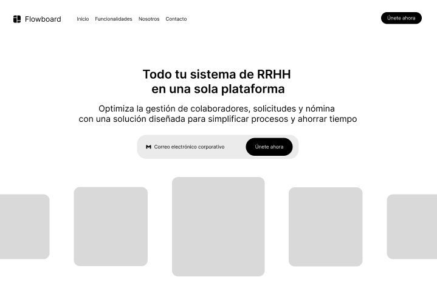
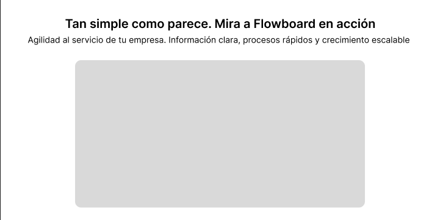
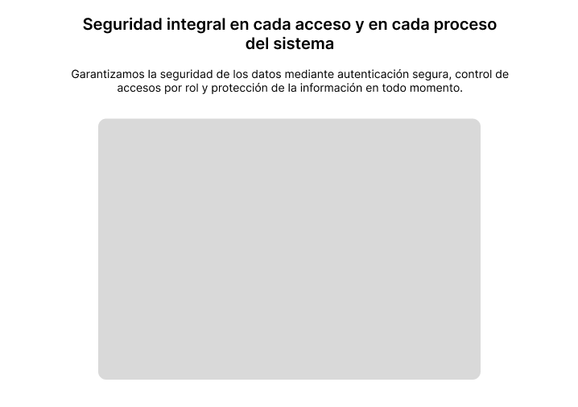
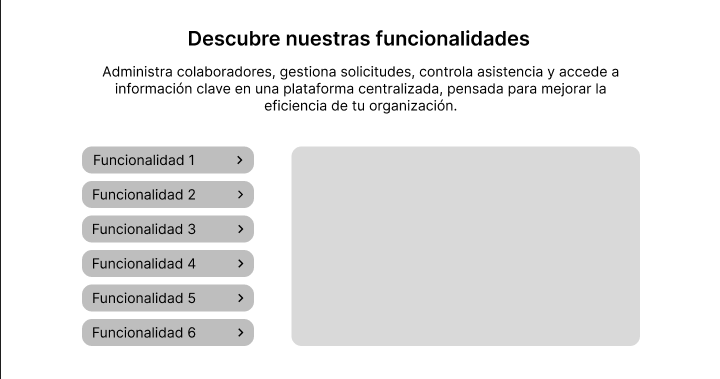
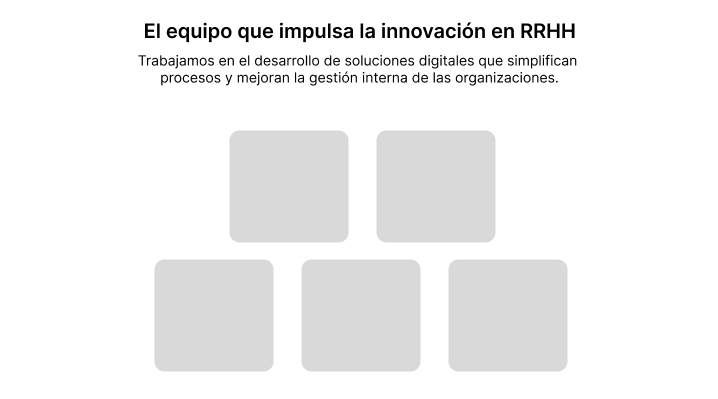
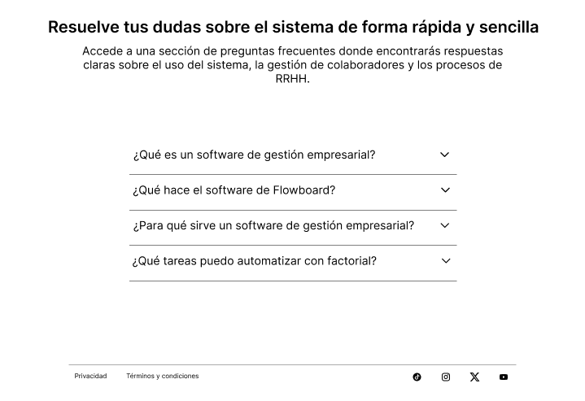
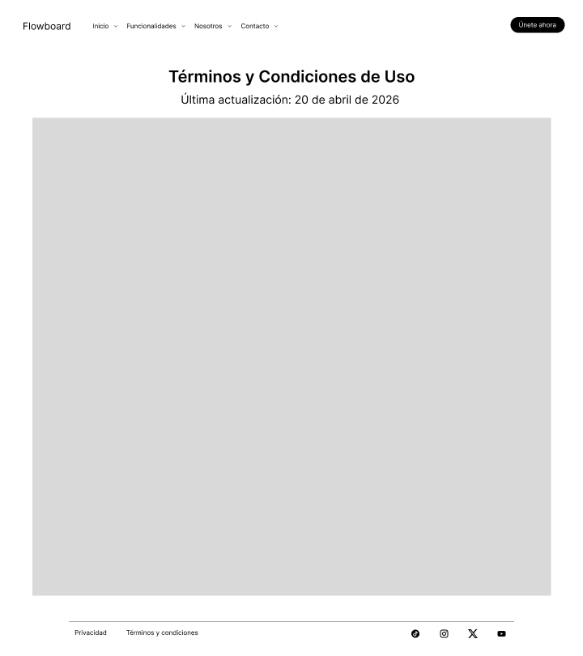

---

### 4.3.2. Landing Page Mock-up

En esta sección se presentan los Mock-ups de alta fidelidad de la Landing Page para Flowboard. Estos diseños representan la evolución final desde los wireframes, mediante la integración de la identidad visual de la startup Performily.

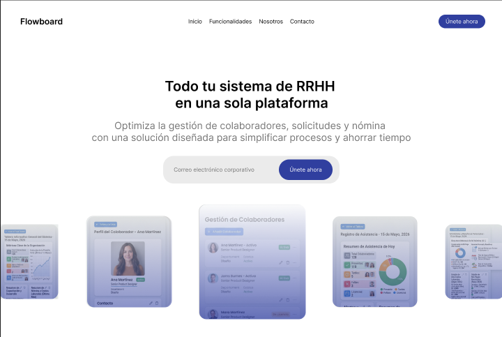
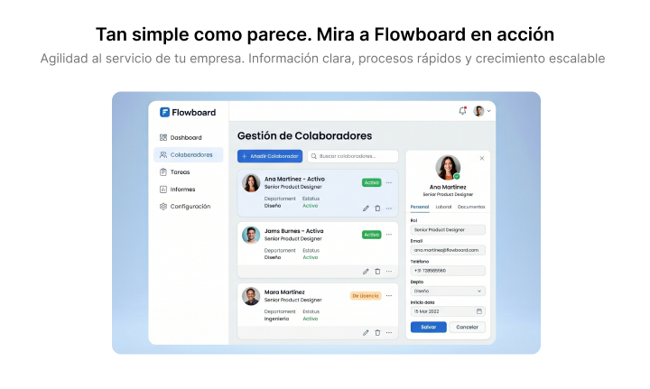
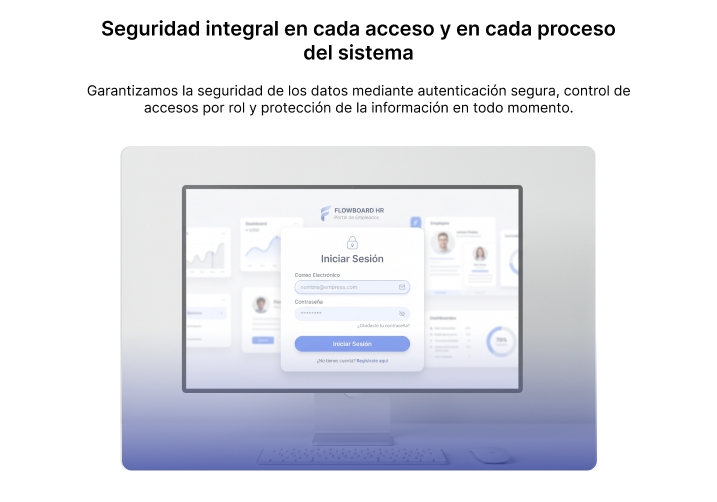
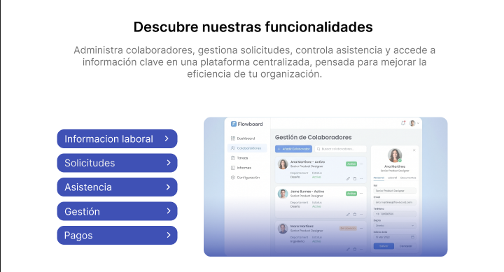
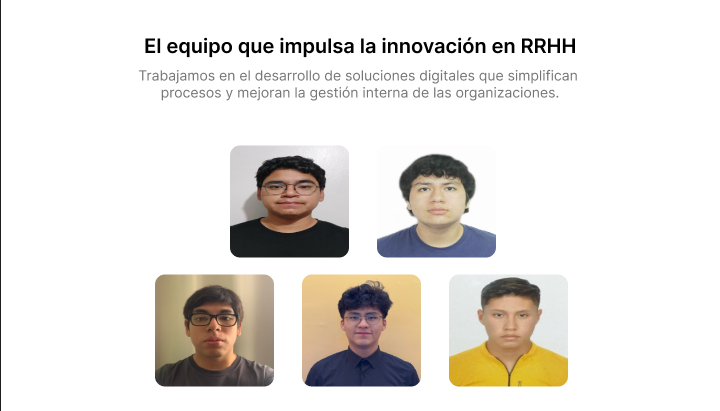
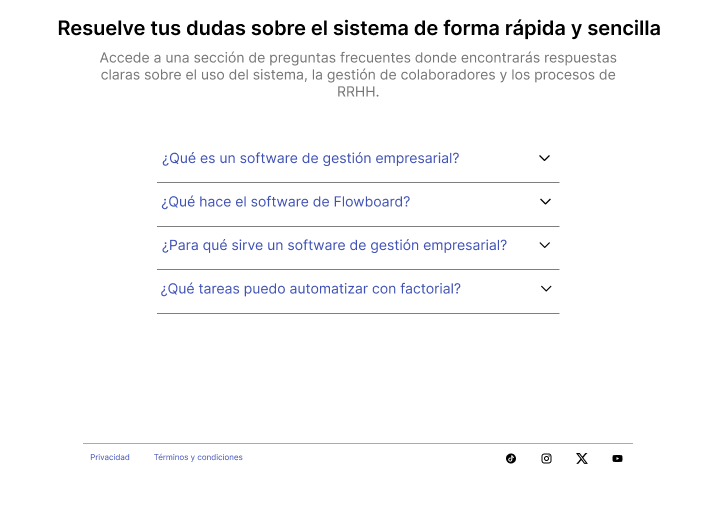
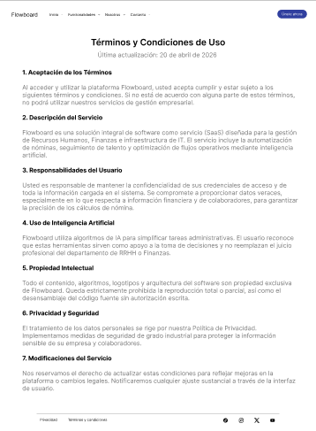
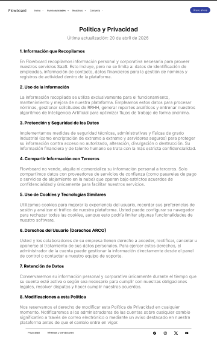

## 4.4. Web Applications UX/UI Design

### 4.4.1. Web Applications Wireframes

https://www.figma.com/design/wB43U9QsN9RLWUJ0sKpTU8/alplicaciones_web_wireframes?node-id=0-1&t=K6t2Zxt5JXHe30Ha-1

---

### 4.4.2. Web Applications Wireflow Diagrams

**Wireflow 1: Agilizar la atención de trámites**

| Campo | Detalle |
| :--- | :--- |
| **User Goal** | Reducir el tiempo de respuesta y aprobación de solicitudes de licencias y vacaciones a menos de 24 horas. |
| **User Persona** | Personal del área de Recursos Humanos. |

**Happy Path:**
El usuario inicia sesión en el sistema, accede a la sección de solicitudes y registra una nueva solicitud de licencia o vacaciones completando correctamente el formulario. El sistema valida la información y envía la solicitud. Posteriormente, el personal de RRHH recibe la notificación, revisa la solicitud y la aprueba. Finalmente, el sistema actualiza el estado y notifica al colaborador sobre la aprobación en un tiempo menor a 24 horas.

---

**Wireflow 2: Autogestionar información laboral**

| Campo | Detalle |
| :--- | :--- |
| **User Goal** | Visualizar información laboral (datos, boletas y vacaciones) en un solo lugar para tener autonomía y evitar tiempos de espera. |
| **User Persona** | Colaboradora de la empresa. |

**Happy Path:**
El colaborador inicia sesión en el sistema y accede al dashboard principal. Desde ahí, navega hacia las diferentes secciones disponibles, como información laboral, pagos o vacaciones. El sistema le permite visualizar sus datos personales y laborales, consultar sus boletas de pago y revisar su saldo de vacaciones de forma clara y organizada. En caso de requerirlo, puede descargar sus boletas o consultar el historial sin necesidad de intervención del área de RRHH.

---

### 4.4.4. Web Applications User Flow Diagrams

**Personal de Recursos Humanos**

| Campo | Detalle |
| :--- | :--- |
| **User Goal** | Como analista de RR.HH. que gestiona múltiples solicitudes manuales, quiero aprobar o rechazar solicitudes de vacaciones/licencias de forma rápida para reducir tiempos de respuesta y evitar retrasos operativos. |
| **Link** | (https://lucid.app/lucidchart/db62f7e6-d2ac-4b5e-980c-3eaf191f3864/edit?invitationId=inv_f8d12bae-c5d8-41c1-8a3b-a825385489b1) |

**Happy Paths:**
1. Accede a la plataforma y entra al módulo de "Solicitudes".
2. Visualiza la lista de solicitudes pendientes de vacaciones/licencias.
3. Selecciona una solicitud y revisa el detalle del colaborador.
4. Aprueba la solicitud y el sistema actualiza el estado automáticamente.
5. El colaborador recibe una notificación con la respuesta.

**Unhappy Paths:**
1. La lista de solicitudes no se carga correctamente por error del sistema.
2. La información de la solicitud está incompleta o desactualizada.
3. Rechaza la solicitud pero no ingresa un motivo, impidiendo completar la acción.
4. El sistema no envía la notificación al colaborador tras la decisión.
5. Ocurre un error al actualizar el estado de la solicitud.

---

**Colaboradores Generales**

| Campo | Detalle                                                                                                                                                                                                   |
| :--- |:----------------------------------------------------------------------------------------------------------------------------------------------------------------------------------------------------------|
| **User Goal** | Como colaboradora que necesita acceder a su información laboral sin depender de RRHH, quiero visualizar mis datos, boletas y vacaciones en un solo lugar para tener autonomía y evitar tiempos de espera. |
| **Link** | https://lucid.app/lucidchart/5cb632a7-ebfa-4468-8f2d-0dddc3803e6d/edit?viewport_loc=-520%2C-1534%2C8013%2C3906%2C0_0&invitationId=inv_88ca2a31-ac55-45e0-8b80-740a7ba412a2                                |

**Happy Paths:**
1. Accede a la plataforma e inicia sesión con sus credenciales.
2. Ingresa al dashboard y visualiza el resumen de su información laboral.
3. Navega a la sección de "Boletas" y revisa su historial de pagos.
4. Descarga su boleta de pago correctamente.
5. Consulta su saldo de vacaciones y estado de solicitudes.

**Unhappy Paths:**
1. No puede iniciar sesión por error en las credenciales.
2. La información de boletas o vacaciones no se carga correctamente.
3. Intenta descargar una boleta y el archivo presenta un error.
4. La información mostrada está desactualizada o incompleta.
5. No encuentra fácilmente la sección que desea consultar dentro del sistema.

---

## 4.5. Web Applications Prototyping

https://www.figma.com/design/wB43U9QsN9RLWUJ0sKpTU8/alplicaciones_web_wireframes?node-id=466-314&t=uPbQqfT8hWHnrBDU-1

---
